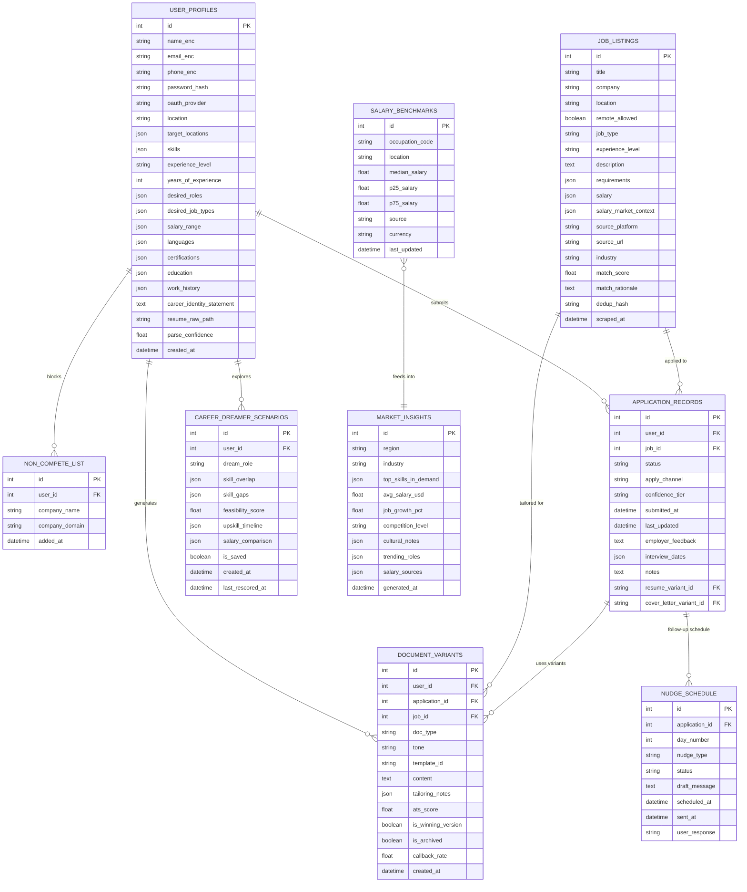
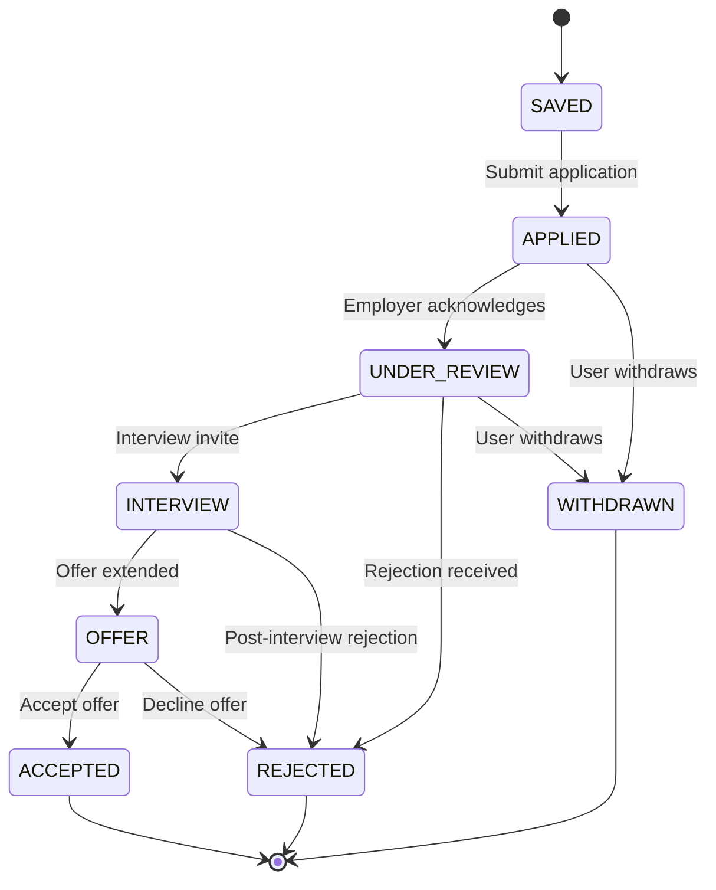
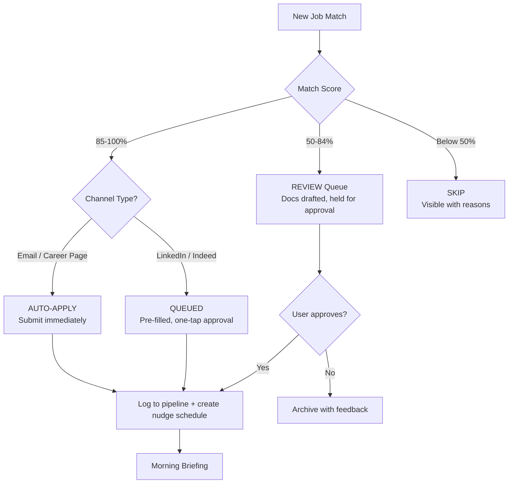
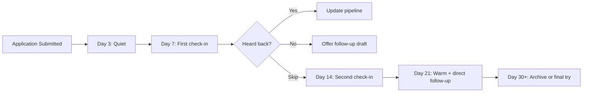
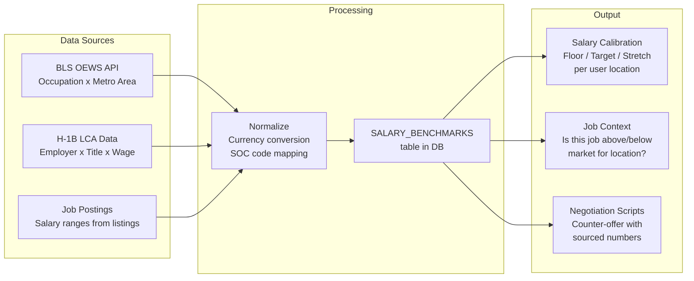

# JobPath AI: Product Requirements Document

**Version:** 3.0
**Date:** 2026-04-10
**Owner:** AVIEN SOLUTIONS

---

## Overview

**Product Name:** JobPath AI

**One-line Description:** An AI career agent that knows your worth, explores your possibilities, tailors every application, applies on your behalf, and learns what works - all while keeping your data private and under your control.

**Problem Statement:** Job seekers spend hours daily copying the same resume into different portals, get ghosted on the majority of applications, and have no systematic way to learn from rejections. Career changers face an even harder challenge: they do not know which skills transfer, what salary to expect in new markets, or how to position themselves for roles they have never held. Existing tools either automate poorly (spray the same resume everywhere) or stop at inspiration ("imagine yourself as...") without helping you actually land the job.

**Solution:** JobPath AI closes the gap between career exploration and career action. It follows a simple principle borrowed from Google Career Dreamer: the AI already did the work, the user just confirms, adjusts, or approves. No blank forms. No manual data entry. No "search and hope." From the first screen to the accepted offer, the agent proposes and the user decides.

**Target Users:** Mid-level professionals seeking remote or international roles, senior engineers exploring relocation, career changers navigating a pivot, and fresh graduates entering the job market for the first time.

**Platform:** Mobile-first progressive web app. Works on phone, tablet, or laptop.

---

## User Personas

### Amara, The Remote Worker
- **Role:** Mid-level Data Analyst, Lagos
- **Goal:** Land remote EU/US roles without spending three hours a day on portals
- **Pain Points:** Resume copy-paste fatigue, 90% ghost rate, no salary benchmarking for cross-border roles
- **What she needs:** "I want to wake up and see that my agent already applied to 10 jobs while I slept."

### Marcus, The Underpaid Senior
- **Role:** Senior DevOps Engineer, Berlin
- **Goal:** Understand his market value and explore US relocation
- **Pain Points:** No salary visibility across borders, previous automation tools got accounts flagged
- **What he needs:** "Show me what I am worth in three cities and apply to the best matches without getting me banned."

### Priya, The Career Changer
- **Role:** Marketing professional pivoting to Product Management, Mumbai
- **Goal:** Identify transferable skills and target realistic roles
- **Pain Points:** Does not know which skills map to the new field, uncertain salary expectations
- **What she needs:** "I need something that gets where I am and shows me exactly how to get where I want to go."

### David, The Fresh Graduate
- **Role:** CS graduate, Toronto
- **Goal:** Get his first job without drowning in job boards
- **Pain Points:** No resume, no idea what roles fit, overwhelmed by choice
- **What he needs:** "Can this thing just tell me what to apply for and do it?"

---

## The Design Standard

Every screen follows one rule: the AI already did the work, the user just confirms, adjusts, or approves.

Every interaction should be:
- **Smart** - AI fills in the answers before the user types
- **Intuitive** - one question at a time, never overwhelming
- **Helpful** - explains WHY, not just WHAT ("Your experience in X translates directly to Y")
- **Inviting** - beautiful transitions, visual exploration, makes you want to click the next thing
- **Warm** - human language, not clinical. "Imagine yourself as..." not "Job listing #4329"

There is no dedicated chat page. The AI appears contextually on every screen through a floating button. Tap it to ask anything - the AI knows which screen you are on, which job you are looking at, which application you are reviewing.

---

## The User Journey

### Step 0: Welcome and Identity

The agent greets the user warmly:

> "Welcome to JobPath. I am your AI career agent. Let us start with who you are."

#### Three paths in (nobody left behind):

**Path A: "I have a resume"**
Upload a PDF, Word doc, or photo. The agent extracts everything and presents it for confirmation using the Career Dreamer scaffold pattern:
- Shows extracted roles as tags (editable, removable, "Add role +")
- For each role, AI generates task descriptions. The user selects which ones they actually did ("Re-generate" if wrong)
- AI generates skills from the role context. The user selects which apply (sourced from O*NET/BLS, cited)
- Education, certifications, and languages are auto-extracted and shown as editable tags
- Confidence flags appear on anything the parser is not sure about

**Path B: "I don't have a resume"**
The agent walks through a friendly conversation, one screen at a time:
1. "Share a current or previous role:" (single text field)
2. "Here are some tasks you might have done. Select the ones that apply:" (AI-generated, selectable, re-generable)
3. "Select the skills that match you:" (AI-generated tags, "More skills..." to add custom)
4. "Any education or certifications?" (optional, add tags)
5. "What are you interested in?" (interests for career exploration)

From these answers, the agent assembles a complete profile AND generates a first resume draft.

**Path C: "Connect LinkedIn"**
OAuth pulls structured profile data. Auto-fills everything. Fastest path. The agent still shows the confirmation screens so the user can adjust.

#### Career Identity Statement

After the profile is ready, the AI generates a Career Identity Statement - a two to three sentence professional summary:

> "I translate complex government initiatives into accessible public narratives through strategic campaign management and cross-functional collaboration."

Marked as "STARTER DRAFT." The user can edit the text directly, re-generate, thumbs up/down, or copy. This becomes:
- Resume header and executive summary
- LinkedIn "About" section
- Elevator pitch for networking

#### Location and Preferences

> "Where do you want to work?"

Multi-select with smart categories:
- Cities (Berlin, Toronto, San Francisco...)
- Remote options (Remote US, Remote Global, Remote EU)
- Arrangements (Hybrid OK, Contract OK, Part-time OK)
- Non-compete list: "Any companies you cannot apply to?" (excludes them from all searches and auto-apply)

#### Sign Up

Email + password or Google OAuth. This persists everything permanently. No more ephemeral sessions.

---

### Step 1: Know Your Worth

Before a single job appears, the agent calibrates the user's market position. Visual presentation, not a wall of text:

**Salary comparison cards** (one per target location):

| Location | Your Range | Market Median | vs. Market |
|----------|-----------|---------------|------------|
| Remote US | $95K-$120K | $110K | On target |
| Berlin | EUR 75K-95K | EUR 82K | Above market |
| San Francisco | $140K-$180K | $155K | Above market |

**Level check card:**
> "You qualify for Senior roles. You have been searching Mid-level. Aim higher - Senior roles in your stack pay 25% more."

**Opportunity spotlight:**
> "The Netherlands has strong demand for your stack, good visa sponsorship, and pays roughly 20% more than Germany."

Data sources cited on every number: BLS OEWS, H-1B LCA, job posting salary ranges.

---

### Step 2: Dream and Explore (Career Dreamer)

This is not hidden in a menu. Right after salary calibration, the agent prompts:

> "Want to explore what is possible? Let us see where your skills could take you."

#### Career Web

A visual constellation of career possibilities radiating from the user's profile center. Each dot is a career path:

- **Data-backed dots** (solid color): Roles where the user has 70%+ skill match. Show real salary and demand data from BLS/O*NET. Example: "Marketing Manager - $166K avg, Bachelor's, strong overlap with your skills"
- **AI-inspired dots** (lighter color): Creative pivots the AI spots from unusual skill combinations. Example: "Your fraud detection + SQL + communication maps well to Product Manager in fintech"

Each dot is clickable. Tapping opens a full role detail card.

#### Role Detail Card

**1. Role Overview**
- "Imagine yourself as: [Role Title]" (gradient text, inviting)
- Description (from O*NET or BLS)
- Average salary (from BLS, per user's target locations, not just US national)
- Typical education level
- Growth outlook (trending up/down/stable)

**2. Sweet Spots** - what already transfers
- Skill tags that overlap with the user's current profile
- Each tag is clickable and reveals a personalized explanation: "Your experience in creating compelling content for government initiatives directly translates to the core responsibilities of a copywriter."
- Re-generate button

**3. A Day in the Life**
- AI-generated daily tasks for this role
- Re-generate button
- Helps the user visualize: "Would I enjoy doing this every day?"

**4. Areas for Growth** - what to learn
- Skill tags the user would need to develop
- Each tag reveals a personalized bridge: "Your experience in X provides a strong foundation. To excel, you will want to deepen your expertise in Y."
- Not just "you are missing X" but "here is how your existing experience CONNECTS to X"
- Re-generate button

**5. Upskilling Resources**
- Carousel of relevant courses, certifications, and bootcamps
- Each shows: title, provider, description, "Learn more" link
- Tied to the specific gaps identified above

**6. Actions**
- "Find jobs for this role" - takes the user to the job feed filtered for this career
- "Save this dream" - stores for ongoing tracking
- "Previous role" / "Next role" navigation

#### Career Dreamer Report

For saved dream roles, a visual report:
- Side-by-side: Current role vs. Dream role
- Skill overlap (progress bars or Venn diagram)
- Missing skills ranked by salary impact: "Learning Kubernetes = +$15K/year in Berlin. 6-week cert."
- Week-by-week upskill timeline
- Feasibility score (0-100) with rationale
- Agent re-scores as the user gains skills over time

---

### Step 3: Skill Gap Intelligence

Presented as a visual dashboard, not a list:

**Your Skills Radar:**
- Visual showing the user's skills mapped against market demand
- Green zone: skills where the user is ahead of most candidates ("Only 12% of candidates in Toronto have Airflow. You do. Lead with that.")
- Yellow zone: nice-to-haves ("Kubernetes shows up in 40% of postings but rarely as a hard requirement")
- Red zone: must-haves the user is missing ("85% of Senior Data Engineer roles in Berlin require Spark")

**Upskill ROI cards** (one per gap):
- Skill name
- Percentage of target jobs requiring it
- Salary impact: "+$15K/year in SF"
- Time to acquire: "6 weeks"
- Recommended resource: specific course or cert with link
- "Add to my plan" button

Every number tied to a dollar figure in the user's target location.

---

### Step 4: Your Job Feed

The home screen is the agent's daily briefing, not a search box:

> "Good morning. 7 new matches since yesterday. 3 are above 90%. I have prepared applications for the top 2."

#### Job Cards

Each card shows:
- Title, company, location, work arrangement (remote/hybrid/on-site tag)
- Salary range + market comparison badge ("12% above market")
- Match score with plain-language AI annotation: "Strong skill match. Your campaign management experience is exactly what they need. Missing: Kubernetes (2-week add)."
- Posted date, source platform
- One-tap actions: "Save" / "Prepare Application" / "Not interested (tell me why)"

#### AI Suggestions Inline
- "You are only searching for Data Analyst. Your profile also fits Analytics Engineer and BI Developer. Want me to include those?"
- On a stretch role: "This one is a reach, but here is what you would need to close the gap."

#### Manual Exploration (when the user wants to browse)
- Full filter panel: role/keyword, location, work arrangement, experience level, salary range, date posted, industry, company size
- Sort by: match score, salary, date, relevance
- Pagination

#### Non-Compete Protection
Companies marked during onboarding are automatically excluded from all results and auto-applications.

---

### Step 5: Prepare and Apply

When the user taps "Prepare Application," the agent runs the full prep. Each step is presented as a card the user reviews:

#### 5a: Tailored Resume
- AI generates a resume customized for THIS specific job
- Keywords from the job description woven in naturally
- Achievements reordered for relevance to this role
- **Humanized writing** - varied sentence structures, natural tone, passes AI detection tools
- Preview shows diff highlights: "I emphasized your campaign analytics experience and added these keywords: [X, Y, Z]"
- Career Identity Statement included as the header
- User can edit anything inline with a rich text editor
- Re-generate with different tone (professional / creative / technical / executive)

#### 5b: Tailored Cover Letter
- Company-specific hook mentioning real company initiatives, news, and values
- Bridges user's experience to this specific role
- **Humanized** - reads like a person wrote it, not AI
- Preview with inline edit capability

#### 5c: ATS Score
- Visual score gauge: "91% - Ready to go" or "72% - Needs improvement"
- If below threshold: specific recommendations with one-tap fix ("Add these 3 keywords? [Yes/No]")
- Agent auto-revises and re-scores

#### 5d: Document Studio (Premium Export)

This is not a basic "download PDF" button. It is a premium document studio:

**Template selection:**
- Multiple professionally designed templates (clean, modern, executive, creative, academic)
- Live preview - see the resume rendered in each template before choosing
- Template remembers the user's preference for next time

**Customization panel:**
- Font selection (professional options: Inter, Garamond, Calibri, etc.)
- Color accent (subtle - section headers, lines, name highlight)
- Section ordering (drag to reorder: Summary, Experience, Skills, Education, Certifications)
- Toggle sections on/off per application (e.g., hide Certifications if irrelevant for this role)
- Margins and spacing controls (compact vs. spacious)

**Final review:**
- Full-page rendered preview exactly as it will look when printed or downloaded
- Spell check + grammar check pass
- AI quality check: "This resume reads naturally and should pass AI detection tools"
- Side-by-side: your resume vs. job requirements (visual match overlay)

**Export options:**
- PDF (print-ready, ATS-compatible formatting)
- DOCX (editable, for portals that require Word)
- Plain text (for copy-paste into application forms)
- "Send to my email" (sends the file to the user's own inbox for easy access)

#### Document Variant System

Every tailored resume and cover letter is saved as a **variant** linked to the specific job application:

- Base resume = user's master profile document
- Each application gets its own variant: "Resume v3 - Stripe Senior Backend Engineer"
- Variants are accessible from the application card in the pipeline
- User can browse all variants: "What did I send to Google? What version did I use for Stripe?"
- Variants include: the resume, the cover letter, the ATS score at time of submission, and the tailoring notes (what was changed and why)

**Variant lifecycle:**
- Variants persist as long as the application is active (Saved through Interview/Offer)
- When application is confirmed Rejected: variants are archived (still viewable but marked as archived)
- When application reaches Accepted: that variant becomes the "winning version" - agent analyzes what made it work and applies those patterns to future applications
- User can manually delete any variant at any time

**Learning from variants:**
- Agent tracks which variant styles get callbacks: "Your technical-tone resumes get 2x more responses for backend roles"
- Over time, the agent learns the user's winning formula and applies it proactively

#### Autonomous Apply (Configurable)

User sets confidence threshold (default 85%):

| Confidence | Channel | Behavior |
|-----------|---------|----------|
| 85%+ | Email / career page | Auto-sent (user notified after) |
| 85%+ | LinkedIn / Indeed | Pre-filled, held for one-tap approval |
| 50-84% | Any | Drafted with docs, held for review |
| Below 50% | Any | Skipped with explanation |

Safety rules:
- NEVER applies to the same company twice (unless different role)
- NEVER applies to non-compete companies
- NEVER sends without humanized documents

#### Morning Briefing (push notification, opt-in)
> "Overnight: 4 applications sent. 2 queued for your review. 1 interview invite from [Company]."

---

### Step 6: Track and Follow Up

#### Visual Pipeline

Kanban board: Saved > Applied > Under Review > Interview > Offer > Accepted / Rejected / Withdrawn

Each card shows real job data (title, company, match score, date applied) and the documents used (tap to view the resume/cover letter variant). The AI surfaces contextual actions per stage:

**Saved:**
- "Ready to apply? Tap to prepare your application."

**Applied - Active Nudge System:**

The agent does not just wait. It checks in with the user on a schedule:

- **Day 3:** Quiet. No nudge. Too early.
- **Day 7:** "It has been a week since you applied to [Company]. Have you heard anything?"
  - User taps: "Yes, got a response" > agent asks for details, updates pipeline
  - User taps: "No, nothing yet" > "Want me to draft a polite follow-up email?" Agent drafts, user reviews and approves.
  - User taps: "Skip" > agent waits another week
- **Day 14:** "Still no word from [Company] after 2 weeks. This is common - 60% of applications take 2-3 weeks. Want me to follow up?"
- **Day 21:** "It has been 3 weeks. At this point, a follow-up can help. I have drafted one that is warm but direct. Want to review it?"
- **Day 30+:** "No response after a month. This one may have gone cold. Want to archive it or give it one more try?"

Each nudge is a gentle push notification or in-app card, never aggressive. The user can disable per-application or globally.

**Under Review:**
- "They are reviewing your application. Your resume variant for this role emphasized [X, Y, Z]. Good fit."
- If user reports they heard back: agent helps with next steps

**Interview Scheduled:**
- "Your interview at [Company] is Thursday at 2pm."
- "Based on the role and this company's recent activity, here are 5 likely questions with talking points from YOUR experience."
- "Their recent hires had system design backgrounds - emphasize your distributed systems work."
- Post-interview: "How did it go? Any feedback?" Agent logs it for pattern analysis.

**Offer Received:**
- "They offered $130K. Market range for your level in this location: $145K-$165K."
- "Here is a counter-offer script with sourced numbers."
- Salary negotiation coach with data
- "Want to compare this offer against your other active applications?"

**Rejected:**
- "Sorry to hear. This is your 3rd rejection from roles requiring system design. Want me to add a prep module to your upskill plan?"
- Pattern detection across all rejections
- Resume variant for this application is archived (still viewable) - agent notes what did not work
- "I noticed the roles you are getting rejected from all ask for [Kubernetes]. Your resume variant did not emphasize container experience. Want me to adjust your base resume?"

**Accepted:**
- Celebration moment. "Congratulations on your new role at [Company]!"
- The winning resume variant is marked as the "winning version"
- Agent analyzes: what was different about this variant? Applies learnings to future applications
- "Want to switch to Career Growth mode? I can help you track your progress in this new role."

#### Cold Outreach (opt-in, approval required)
> "3 people from your alumni network work at [Company X] which has 2 open roles matching your profile. Want me to draft an introduction message?"

Agent drafts. User reviews. Nothing sends without explicit approval.

---

### Step 7: Dashboard and Career Advisor

#### For New Users - Guided Journey (not an empty dashboard)

Visual checklist with progress:
- [ ] Tell us about yourself (profile)
- [ ] Discover your market value (salary calibration)
- [ ] Explore career possibilities (career dreamer)
- [ ] Review your skill gaps
- [ ] Apply to your first opportunity

Each step links directly to the relevant screen.

#### For Active Users - Weekly Intelligence Report

Visual cards, not a text dump:

**Performance card:**
- "12 applications this week. 3 callbacks (25%, up from 15%)."
- Trend chart showing improvement over time

**Pattern card:**
- "Your fintech applications get 3x more responses than enterprise."
- "Technical-tone resumes outperform creative 2:1 for backend roles."
- "Cover letters mentioning open-source get 2x more callbacks."

**Recommendation card:**
- "Focus on fintech this week - your callback rate there is 3x higher."
- "Consider pivoting from Staff to Senior - your Senior applications perform better."

#### Career Dreamer Tracking

Saved dream goals update over time:
> "Your ML Engineer dream went from 58 to 71 feasibility since you completed that PyTorch course last month."

#### Dashboard API Requirements

| Endpoint | Method | Returns |
|----------|--------|---------|
| `/api/dashboard/kpis` | GET | `{ total, response_rate, interview_rate, offer_rate, avg_days_to_reply }` |
| `/api/dashboard/pipeline` | GET | `{ by_status: { status: count } }` |
| `/api/dashboard/charts` | GET | `{ by_industry: [...], by_platform: [...], weekly_response_rates: [...] }` |
| `/api/dashboard/insights` | GET | `{ bullets: [...], feedback_themes: [...] }` |

All endpoints require authentication. All return JSON.

---

### Step 8: Account and Data

#### Settings
- Profile editing (all fields, Career Identity Statement)
- Non-compete company list
- Auto-apply threshold and channel preferences
- Notification preferences (morning briefing, new matches, interview reminders, weekly report)
- Connected accounts (email for sending, LinkedIn for import)
- Theme (light/dark/system)

#### Data Ownership
- **Export my data** - ZIP of everything: profile, applications, resumes, cover letters, career dreamer reports, analytics
- **Delete my account** - cascading delete, confirmation required, data permanently removed from all systems
- **Sign out** - real logout, clears tokens

---

## What Makes This Different

| Competitor | What they offer | Where JobPath goes further |
|---|---|---|
| **Google Career Dreamer** | Explore career possibilities. Stops at "find jobs near you" link | We find the jobs, prepare the application, apply, track, and learn from outcomes |
| **Teal** | Manual resume builder + tracker | Agent writes the resume (humanized), agent tracks, agent follows up |
| **Jobscan** | ATS score for one job at a time | ATS check automatic for every application, agent auto-fixes issues |
| **LazyApply** | Same resume to 100 jobs (spray-and-pray) | Every resume tailored. Only high-confidence matches. Quality over volume |
| **LinkedIn Premium** | Salary insights, who viewed your profile | Multi-location salary calibration, skill gap ROI, career dreamer, autonomous apply |

**The moat:** Google Career Dreamer ends at "imagine yourself as..." JobPath starts there and gets you the job.

---

## Feature Map

### Feature Status Legend

| Status | Meaning |
|--------|---------|
| Built | Fully implemented and tested |
| In Progress | Partially implemented |
| Designed | Detailed design complete, ready to build |
| Planned | On the roadmap but not yet designed |

### Detailed Feature Inventory

| Category | Feature | Status | Notes |
|----------|---------|--------|-------|
| **Onboarding** | Resume upload and AI parse | Built | PDF, DOCX, image via Claude Vision |
| | Career Dreamer scaffold (role > tasks > skills confirmation) | Designed | Google Career Dreamer pattern |
| | No-resume conversational onboarding | Designed | Agent builds profile from step-by-step Q&A |
| | Career Identity Statement generator | Designed | 2-3 sentence professional summary, editable |
| | LinkedIn OAuth import | Designed | Pulls structured profile, user confirms |
| | O*NET / BLS skill taxonomy mapping | Designed | Cited skill sources |
| | Non-compete company list | Designed | Excludes from all searches and auto-apply |
| **Job Discovery** | LLM-based match scoring (0-100) | Built | Bias-free, skill-based |
| | Location-based filtering | Built | Substring match + remote toggle |
| | Real job board API adapters | Built | JSearch + Adzuna |
| | Agent-curated daily job feed | Designed | Morning briefing, not a search box |
| | AI role expansion suggestions | Designed | "Your profile also fits Analytics Engineer" |
| | Non-compete auto-exclusion | Designed | Companies blocked from all results |
| | Advanced search filters | Designed | Wire unused JSearch/Adzuna parameters |
| | Company watchlists | Planned | Monitor careers pages for new postings |
| | Paste-a-URL import | Planned | Scrape any job listing URL |
| | Cross-board deduplication | Planned | Same job on 3 boards = shown once |
| **Documents** | Tailored resume generation (3 tones) | Built | Professional, creative, technical |
| | Tailored cover letter generation | Built | Region-aware |
| | Improvement suggestions | Built | 5-7 actionable items |
| | Humanized writing (AI detection resistant) | Designed | Varied structure, natural tone |
| | Document Studio (template, font, layout) | Designed | Premium export with live preview |
| | PDF/DOCX/plain text export | Designed | ATS-compatible formatting |
| | Document variant system (per-application) | Designed | Linked to pipeline, lifecycle management |
| | Variant learning (callback correlation) | Designed | Tracks winning formulas |
| | ATS scoring with auto-fix | Designed | Visual gauge, one-tap keyword insertion |
| **Tracking** | CRUD application records | Built | SQLite persistence |
| | 7-status workflow | Built | DRAFT through OFFER/REJECTED |
| | Employer feedback logging | Built | Free-text per application |
| | Visual Kanban pipeline | Designed | Cards with docs and contextual actions |
| | Follow-up nudge system (Day 7/14/21/30) | Designed | Gentle check-ins with draft follow-ups |
| | Autonomous apply (channel-aware tiers) | Designed | 85% default threshold |
| | Email integration (OAuth) | Designed | Gmail/Outlook response tracking |
| | Morning briefing notification | Designed | Overnight activity summary |
| | Cold outreach drafts (with approval) | Designed | Alumni network connections |
| **Analytics** | Response/interview/offer rates | Built | Computed from application data |
| | Avg days-to-reply | Built | Submission to first response |
| | Top industries and platforms | Built | Aggregated from applications |
| | AI-generated insights | Built | 3-5 actionable bullets via LLM |
| | Feedback pattern analysis | Built | Rejection themes + action items |
| | Weekly intelligence report | Designed | Performance, patterns, recommendations |
| | Rejection pattern detection | Designed | Cross-application analysis |
| **Market Intel** | Region/industry analysis | Built | LLM-synthesized market data |
| | Culturally-aware tips | Built | CV format, interview etiquette by region |
| | Location-based salary calibration | Built | BLS + H-1B + job posting extraction |
| | Skill gap analysis with $ ROI | Built | Upskill recommendations with dollar impact |
| | Career Dreamer: career web visualization | Designed | Interactive constellation of career paths |
| | Career Dreamer: role detail cards | Designed | Sweet spots, growth areas, day-in-the-life |
| | Career Dreamer: feasibility scorer (0-100) | Built | Data-backed dream score |
| | Career Dreamer: upskilling resources | Designed | Course/cert carousel per gap |
| | Career Dreamer: ongoing re-scoring | Designed | Updates as user gains skills |
| | Skills radar dashboard | Designed | Green/yellow/red zones vs. market demand |
| | Level calibration | Designed | "You qualify for Senior, stop searching Mid" |
| | Country/region arbitrage | Designed | Compare salary across target locations |
| | Salary negotiation scripts | Designed | Counter-offer with sourced numbers |
| | Interview prep | Designed | Role-specific, company-researched |
| **Privacy** | AES-256-GCM PII encryption | Built | PBKDF2 key derivation, 390K iterations |
| | LLM field sanitization | Built | Only safe fields sent to LLM |
| | Protected attribute stripping | Built | Gender, age, race removed before scoring |
| **Auth & Data** | Real authentication (email + OAuth) | Designed | Persistent accounts, not ephemeral sessions |
| | Data export (full ZIP) | Designed | Profile, applications, docs, analytics |
| | Account deletion (cascading) | Designed | GDPR-compliant permanent removal |
| **Interface** | FastAPI HTTP API | Built | 20+ endpoints with /api/ prefix |
| | HTML frontend (SPA) | Built | Landing + dashboard |
| | Rich terminal CLI | Built | Profile wizard, interactive menu |
| | Contextual AI (floating button) | Designed | Screen-aware, no dedicated chat page |
| | Mobile-first PWA | Designed | Responsive across devices |

---

## Data Sources

| Source | What it provides | Cost |
|--------|-----------------|------|
| **BLS OEWS API** | Occupation-level wages by metro area | Free, 500 queries/day |
| **H-1B LCA data** | Company-specific salaries (DOL bulk download) | Free, millions of records |
| **O*NET** | Occupation descriptions, skills, education, growth outlook | Free |
| **JSearch API** | Indeed/LinkedIn/Glassdoor job listings | Free tier + paid |
| **Adzuna API** | Job listings across 20 countries | Free tier + paid |
| **Job posting salary extraction** | Parse salary ranges from listings (pay transparency laws) | Free (already in pipeline) |

BLS + H-1B + O*NET + job posting extraction provides roughly 80% of what Lightcast gives Google, at zero cost.

### Salary Data Pipeline

1. **User selects location(s)** during profile setup or job search
2. **BLS OEWS** provides baseline median/mean wages by SOC occupation code + metro area
3. **H-1B LCA data** adds company-specific salary data (especially strong for tech)
4. **Job posting ranges** extracted from listings the agent already pulls (pay transparency laws in NY, CA, CO, WA mean more postings include ranges)
5. **LLM layer** synthesizes all sources into actionable recommendations

Every salary number shows its source and when it was last updated.

### Company Insights (Without Glassdoor)

Since Glassdoor's API is shut down, company review and culture data comes from:
- **LLM knowledge:** Claude/Gemini have trained on extensive company data (funding, culture signals, tech stack)
- **Public data:** Crunchbase (funding), GitHub (tech stack), press/news
- **User-contributed:** As users track applications and log feedback, the platform builds its own dataset

---

## Data Model

### Core Entities

### Key Relationships

- **User > Applications:** One user has many applications (1:N)
- **User > Non-compete list:** One user blocks many companies (1:N)
- **User > Career Dreamer Scenarios:** One user can save many dream roles (1:N)
- **Application > Document Variants:** Each application has one or more variants (resume, cover letter) (1:N)
- **Application > Nudge Schedule:** Each application has a follow-up schedule (1:N)
- **Job > Applications:** One job listing can have one application per user (1:N)
- **Salary Benchmarks > Market Insights:** Benchmark data feeds into market analysis

### New Entities (vs v2.0)

| Entity | Purpose |
|--------|---------|
| `NON_COMPETE_LIST` | Companies excluded from all searches and auto-apply |
| `DOCUMENT_VARIANTS` | Per-application resume/cover letter with template, ATS score, winning flag |
| `NUDGE_SCHEDULE` | Follow-up check-ins at Day 7/14/21/30 with draft messages |
| `CAREER_DREAMER_SCENARIOS` | Saved dream roles with skill overlap, gaps, feasibility, upskill timeline |
| `career_identity_statement` (on USER_PROFILES) | AI-generated professional summary used as resume header |
| `password_hash` / `oauth_provider` (on USER_PROFILES) | Real authentication replacing ephemeral sessions |

---

## Multi-Agent Architecture

Ten specialized agents, each running on the optimal model through OpenRouter for cost efficiency:

| Agent Group | Model | Cost Share | Agents |
|------------|-------|-----------|--------|
| High-volume, low-cost | Gemini Flash | ~70% of calls | Scout (job APIs, dedup, URL parsing), Inbox (email monitoring, reply classification) |
| Mid-tier | Gemini Pro / Claude Haiku | ~25% of calls | Match (job scoring), Analytics (outcome tracking), Apply (form filling, submission), Privacy (encryption, PII) |
| Quality-critical | Claude Sonnet | ~5% of calls | Writer (resumes, cover letters), Market (salary, skill demand), Advisor (briefs, negotiation), Parser (resume extraction) |

**Blended cost: roughly $1.50-3/user/month.** Gemini Flash carries most of the load at near-zero cost. Claude Sonnet handles the fraction where writing quality matters.

---

## Non-Functional Requirements

### Performance

| Metric | Target |
|--------|--------|
| Resume parsing (PDF/DOCX) | < 8s |
| Resume parsing (image/scan) | < 15s (Claude Vision) |
| Job search response time | < 10s (including LLM scoring) |
| Salary calibration | < 5s (cached BLS/H-1B data) |
| Document generation | < 15s per resume/cover letter |
| ATS scoring | < 5s per document |
| Analytics computation | < 2s for up to 1,000 applications |
| API response (health check) | < 100ms |
| Chat endpoint (with LLM) | < 30s |

### Security

- **Encryption at rest:** AES-256-GCM for all PII fields (name, email, phone)
- **Key derivation:** PBKDF2-HMAC-SHA256, 390,000 iterations (OWASP 2023)
- **LLM data isolation:** Only sanitized fields (skills, experience, education) sent to LLM, never PII
- **Bias mitigation:** Protected attributes (gender, age, race, ethnicity, religion, nationality) stripped before all scoring operations
- **Authentication:** Email + password with bcrypt hashing, or Google OAuth. Session tokens with expiry.
- **API security:** CORS configured, authenticated endpoints, structured error responses (no stack trace leakage)
- **OAuth scopes:** Gmail/Outlook with minimal scopes (readonly + labels). Agent only watches job-related threads.
- **Resume storage:** Uploaded files encrypted at rest, deleted after parsing unless user opts to keep
- **Account deletion:** Cascading delete of all user data, GDPR-compliant

### Scalability

- **Phase 1 (current):** Single-user SQLite, in-memory sessions, suitable for personal use and demo
- **Phase 2:** PostgreSQL migration via Alembic, connection pooling, async DB sessions
- **Phase 3:** Multi-tenant with rate limiting, Redis session store

### Reliability

- Health check endpoint always available
- Graceful error handling via `AppError` classes
- `with_retry` decorator for external service calls (LLM API)
- Structured error format: `{ error: { code, message } }`
- Salary data fallback chain: BLS > H-1B > job posting ranges > LLM estimates (always labeled)

---

## Risk Register

| Risk | Severity | Mitigation |
|------|----------|------------|
| **Platform account bans** | CRITICAL | Only auto-submit through safe channels. LinkedIn/Indeed apps queued for user's own tap. Zero ban risk by design. |
| **Legal liability (ToS/scraping)** | CRITICAL | All job data from legitimate APIs or single-URL parsing initiated by user. No scraping. |
| **AI hallucinating credentials** | HIGH | Writer agent can only use verified profile data. Every generated doc shows a diff. System prompts have hard guardrails. |
| **AI-generated text flagged by employers** | HIGH | Humanized writing with varied structure, natural tone, and sentence-level diversity. Quality check included in Document Studio. |
| **Stale salary data** | HIGH | Multi-source strategy (BLS + H-1B + job postings). Every number shows source and last-updated date. Refreshed monthly. |
| **Aggregator APIs deprecate** | HIGH | Pull from multiple sources; never depend on one. User-pasted URLs work as fallback. |
| **Email OAuth verification delay** | MEDIUM | Start Google OAuth review early (4-6 weeks). Tool works without email; users update statuses manually. |
| **User churn after placement** | MEDIUM | "Career growth mode" keeps tool useful with salary benchmarking, skill tracking, passive monitoring. |
| **GDPR / privacy regulations** | MEDIUM | AES-256-GCM encryption. Full data export. One-click account deletion. DSAR compliance. |
| **Non-compete violation** | MEDIUM | User-managed exclusion list enforced at search, feed, and auto-apply layers. Agent never overrides. |

---

## Milestones

### Sprint 1: Foundation

*Goal: Real auth, persistent profiles, and the onboarding experience that sets JobPath apart*

- [ ] Authentication (GCP Identity Platform, email + Google OAuth)
- [ ] Fix session_store user_id mapping
- [ ] Wire profile_to_orm() so profiles persist to DB
- [ ] Scaffold onboarding: role input > AI task generation > skill selection > Career Identity Statement
- [ ] Rich job cards in search results (backend has the data, frontend does not show it)
- [ ] Job detail screen with save/apply actions
- [ ] Non-compete company list (stored and enforced)

### Sprint 2: The Experience

*Goal: Career Dreamer, Document Studio, and the full application prep flow*

- [ ] Career Dreamer: career web visualization, role detail cards (sweet spots, growth areas, upskilling resources)
- [ ] Career Dreamer: feasibility scoring and saved scenarios
- [ ] Application prep flow: tailored resume > cover letter > ATS score > Document Studio export > track
- [ ] Humanized document generation (pass AI detection)
- [ ] Document variant system (per-application storage and lifecycle)
- [ ] Advanced search filters (wire unused JSearch/Adzuna parameters)
- [ ] Salary calibration with visual cards (BLS + H-1B + job posting extraction)
- [ ] Skills radar dashboard

### Sprint 3: Agent Autonomy

*Goal: The agent works while you sleep*

- [ ] Daily curated job feed (agent auto-searches based on profile)
- [ ] Autonomous apply with confidence tiers (85% default)
- [ ] Morning briefing notifications
- [ ] Follow-up nudge system (Day 7/14/21/30 check-ins)
- [ ] Non-compete enforcement at search and auto-apply layers
- [ ] Email OAuth integration for response tracking

### Sprint 4: Intelligence and Growth

*Goal: The agent gets smarter with every application*

- [ ] Outcome learning (correlate resume variants with callbacks)
- [ ] Rejection pattern analysis across applications
- [ ] Weekly intelligence report (performance, patterns, recommendations)
- [ ] Cold outreach drafts (with user approval)
- [ ] Salary negotiation scripts with sourced data
- [ ] Interview prep (role-specific, company-researched)
- [ ] Career Dreamer ongoing re-scoring (updates as user grows)
- [ ] Account lifecycle (full data export + cascading delete)
- [ ] Contextual AI floating button on every screen

### Not in scope (separate products/timelines):
- Employer portal
- Admin portal
- Stripe payments (not until product-market fit)

---

## Pricing

| | Free / Open Source | Pro | Career Engine |
|---|---|---|---|
| **Price** | $0 | $24/mo | $49/mo |
| Self-hosted, local data | Yes | Yes | Yes |
| Resume parsing + profile builder | Yes | Yes | Yes |
| Career Identity Statement | Yes | Yes | Yes |
| Application tracker (manual) | Yes | Yes | Yes |
| Basic analytics | Yes | Yes | Yes |
| Privacy encryption | Yes | Yes | Yes |
| AI resume tailoring | 5/month | Unlimited | Unlimited |
| Mobile-first web app | - | Yes | Yes |
| Agent-curated job feed | - | Yes | Yes |
| Autonomous apply (safe channels) | - | Yes | Yes |
| Morning briefing | - | Yes | Yes |
| Market salary insights | - | Yes | Yes |
| Skill gap analysis | - | Yes | Yes |
| Document Studio (templates, export) | - | Yes | Yes |
| Email response tracking | - | Yes | Yes |
| Follow-up nudge system | - | Yes | Yes |
| Career Dreamer (full exploration) | - | - | Yes |
| Outcome learning loop | - | - | Yes |
| AI career advisor (weekly reports) | - | - | Yes |
| Salary negotiation scripts | - | - | Yes |
| Country arbitrage analysis | - | - | Yes |
| Interview prep | - | - | Yes |
| Cold outreach drafts | - | - | Yes |
| Company watchlist | - | - | Yes |
| Priority support | - | - | Yes |

**Cost model:** Blended LLM cost roughly $1.50-3/user/month via OpenRouter multi-model routing. Gemini Flash handles 70% of calls at near-zero cost.

---

## Technical Stack

| Layer | Technology |
|-------|-----------|
| Language | Python 3.9+ |
| Web Framework | FastAPI 0.111+ |
| ORM | SQLAlchemy (sync 1.x-style session.query()) |
| Database | SQLite (Phase 1), PostgreSQL (Phase 2+) |
| Migrations | Alembic |
| Validation | Pydantic v2 |
| Authentication | GCP Identity Platform (email + Google OAuth) |
| LLM Routing | OpenRouter (Claude Sonnet, Gemini Flash/Pro, Claude Haiku) |
| Resume Parsing | Claude Vision + Gemini Flash |
| Salary Data | BLS OEWS API + H-1B LCA bulk data + job posting extraction |
| Skill Taxonomy | O*NET + BLS occupation data |
| Encryption | `cryptography` (AES-256-GCM) |
| CLI | Rich |
| HTTP Client | httpx |
| Testing | pytest |
| CI/CD | GitHub Actions |
| Deployment | Render + Google Cloud Run |

---

## Appendix: Application Status Workflow

## Appendix: Autonomous Apply Decision Tree

## Appendix: Follow-Up Nudge Timeline

## Appendix: Salary Data Pipeline

