# AI Job Agent: Product Requirements Document

**Version:** 2.0
**Date:** 2026-03-15
**Owner:** AVIEN SOLUTIONS

---

## Overview

**Product Name:** AI Job Agent

**One-line Description:** An AI-powered career strategist that finds jobs, tailors resumes, applies autonomously, and provides location-aware salary intelligence, all while protecting user privacy.

**Problem Statement:** Job seekers spend hours daily copying the same resume into different portals, get ghosted on the majority of applications, lack market salary data, and have no systematic way to track their progress or learn from rejections. Career changers and international job seekers face additional challenges: they don't know which skills transfer, what salary to expect in different markets, or how to tailor applications for regional norms.

**Target Users:** Mid-level professionals seeking remote/international roles, senior engineers exploring relocation, career changers, and fresh graduates entering the job market.

---

## User Personas

### Amara, The Remote Worker
- **Role:** Mid-level Data Analyst, Lagos
- **Goal:** Land remote EU/US roles without spending 3+ hours/day on portals
- **Pain Points:** Resume copy-paste fatigue, 90% ghost rate, no salary benchmarking for cross-border roles
- **Quote:** *"I want to wake up and see that my agent already applied to 10 jobs while I slept."*

### Marcus, The Underpaid Senior
- **Role:** Senior DevOps Engineer, Berlin
- **Goal:** Understand his market value and explore US relocation
- **Pain Points:** No salary visibility, previous automation tools got accounts flagged
- **Quote:** *"I need something smart enough to apply for me without getting my accounts banned."*

### Priya, The Career Changer
- **Role:** Marketing professional pivoting to Product Management, Mumbai
- **Goal:** Identify transferable skills and target realistic roles
- **Pain Points:** Doesn't know which skills map to new field, uncertain salary expectations
- **Quote:** *"I need something that gets where I am and where I'm trying to go."*

### David, The Fresh Graduate
- **Role:** CS graduate, Toronto
- **Goal:** Get his first job without drowning in job boards
- **Pain Points:** No resume, no idea what roles fit, overwhelmed by choice
- **Quote:** *"Can this thing just tell me what to apply for and do it?"*

---

## The User Journey

### Step 0: Signup & Onboarding

Three ways in, nobody left behind:

1. **"I have a resume"** → Upload it (Step 1)
2. **"I don't have a resume"** → The agent walks you through questions about your education, projects, and skills. Builds your first resume from the conversation.
3. **"I just want to look around"** → Jump straight to the job feed with a bare-bones profile. You'll need to fill it in before you can apply.

Users connect their email (Gmail or Outlook, via OAuth) during signup for autonomous apply and response tracking. Optional +jobs alias for separation.

**Platform:** Mobile-first web app, built as a PWA. Works on phone, tablet, or laptop.

### Step 1: Resume Upload & Smart Parse

Hand it a PDF, Word doc, or even a photo of a printed resume. The AI pulls out everything:

- Contact info, location, languages
- Work history with dates, titles, and accomplishments
- Skills, mapped to O\*NET and ESCO taxonomies
- Education and certifications

Everything is pre-filled but editable. Fields the parser isn't sure about get flagged with confidence indicators.

**Parsing stack:** Claude Vision for scanned/multi-column/non-English resumes. Gemini Flash for clean text extraction.

### Step 2: Know Your Worth (Location-Based Salary Calibration)

Before applying, the agent compares the user's resume against real market data **for their selected location** and tells them what to target:

- **Market arbitrage:** "Your skills pull $95K remote from Lagos, $140K in Berlin, $180K in San Francisco"
- **Level calibration:** "You qualify for Senior. You're searching Mid-level. Aim higher."
- **Salary range:** Floor, target, and stretch numbers, broken out by the user's chosen region(s)
- **Country opportunities:** "The Netherlands has strong demand for your stack, good visa sponsorship, and pays about 20% more"

**Location is the anchor.** All salary recommendations, job matches, and market insights are filtered and calibrated to the location(s) the applicant selects. Users can add multiple target locations to compare.

**Career Dreamer: "What if?"** — At this point the user can explore hypothetical scenarios, not just their current profile. "What if I moved to Berlin as a Product Manager?" The agent builds a side-by-side salary comparison (current role/location vs. dream role/location), shows the gap, and scores the scenario's feasibility from 0-100. This feeds directly into Step 3's skill gap analysis for the dream role.

### Step 3: Skill Gap Intelligence

The agent analyzes thousands of live job postings for the user's target roles **in their chosen location** and reports:

- **Must-have gaps:** "85% of Senior Data Engineer roles in Berlin ask for Spark. You don't have it listed."
- **Nice-to-have gaps:** "Kubernetes shows up in 40% of postings but almost never as a hard requirement."
- **Hidden strengths:** "Only 12% of candidates in Toronto have Airflow experience. You do. Lead with that."
- **Upskill ROI:** "Getting an AWS cert would bump your match rate by 30% and move you up about $15K in San Francisco. Takes about 6 weeks."
- **Learning paths:** Specific courses, certs, and time estimates

Every recommendation comes with a dollar figure tied to the user's location: "Learning X is worth $Y more per year in [location]."

**Career Dreamer: Gap Report + Timeline** — If the user entered a dream scenario in Step 2, the skill gap analysis runs against the *dream role*, not just their current targets. The agent shows which of their existing skills transfer (with overlap percentage), which new skills to acquire ranked by impact on match rate, and builds a week-by-week upskill timeline: "Week 1-4: Complete AWS ML Specialty cert. Week 5-8: Build a portfolio project using PyTorch." Each skill shows estimated time, cost, and salary impact.

### Step 4: Job Discovery (All Sources, One Feed)

Jobs from multiple sources, deduplicated into one feed:

- **Aggregator APIs:** Adzuna, JSearch, Jooble, Reed, Arbeitnow, Remotive, The Muse
- **Paste a URL:** Found something on LinkedIn? Paste the link. The agent grabs the listing, scores it, and adds it to your feed.
- **Company watchlist:** Pick companies you like and the agent monitors their careers pages

Deduplication across boards. Every listing gets a 0-100 score with a plain-language explanation. New matches surface daily. The agent may suggest role expansions: "You're only looking at Data Analyst roles, but your profile is a good fit for Analytics Engineer too."

### Step 5: Per-Job Tailored Documents

Every application gets its own resume. Not one generic version sent to 50 companies:

- Keywords pulled from the job description for ATS optimization
- Achievements reordered and reframed for the specific role
- Cover letter with a real hook about the company
- Export as **PDF, DOCX, or Markdown**
- Tailoring notes show exactly what changed and why
- **Nothing gets fabricated.** The agent only uses verified profile data.

Over time, the agent tracks which versions work: "Your technical-tone resumes get twice as many callbacks for backend roles."

### Step 6: Autonomous Apply (Works While You Sleep)

Every matched job gets a confidence score. The agent knows which channels are safe vs. risky:

| Tier | Confidence | Behavior |
|------|-----------|----------|
| **AUTO-APPLY** | 80-100% | Sent automatically on safe channels |
| **REVIEW** | 50-79% | Prepared with drafts, held for user approval |
| **SKIP** | Below 50% | Not worth the user's time, visible with reasons |

**Safe channels (fully autonomous):** Email applications, company career pages, open API boards (Arbeitnow, Remotive).

**Risky channels (one-tap approval):** LinkedIn, Indeed, Workday, Greenhouse. Pre-filled and saved as drafts. User batch-approves each morning.

### Step 7: Response Tracking & Pipeline

- Every application is tracked: submitted → under review → interview → offer/rejected
- **Email monitoring via OAuth:** The agent reads employer replies, classifies them (rejection, interview invite, follow-up request, offer), and auto-updates the pipeline
- **Interview detected?** "You've got an interview at Stripe, Thursday 2pm. Want me to add it to your calendar? Here's a prep doc."
- **Ghosted for 7 days?** The agent drafts a follow-up email for review
- All employer feedback is logged and analyzed across full application history

### Step 8: AI Career Advisor

Not just a form filler. It is a strategic advisor that improves with use:

- **Weekly brief:** "You applied to 34 jobs this week. Got 8 callbacks (24%, up from 15%). Fintech is your strongest sector."
- **Pivot suggestions:** "You keep getting turned down for Staff roles. Senior is a stronger fit right now."
- **Salary negotiation:** "They offered $130K. For your profile in this market, $145K is more in line. Here's a counter script."
- **Interview prep:** Mock interviews tailored to the role, common questions for the company, research brief
- **Honest assessment:** "This one's a stretch. Here's what you'd need to close the gap."

**Career Dreamer: Ongoing Tracking + Pivot Intelligence** — Saved dream goals from Step 2 live here. As the user gains experience, completes courses, or receives feedback, the advisor re-scores dream feasibility and updates the gap report. It also connects rejection patterns to dream goals: "You've been rejected from 3 Staff-level roles. Your ML Engineer dream is actually more feasible right now. Your feasibility score went from 58 to 71 since you completed that PyTorch cert last month." The advisor proactively suggests new dreams based on patterns it sees: "Your Finance applications have a 35% callback rate. Have you considered a FinTech product role? Here's what the pivot looks like."

---

## Analytics Dashboard

The Analytics Dashboard is the user's command center for understanding their job search performance. It consolidates metrics, pipeline status, and AI-generated insights into a single view.

### Dashboard Layout

The dashboard is divided into four sections, top to bottom:

**Section 1: KPI Cards (top row)**

Four cards displayed in a horizontal row:

| Card | Value | Subtext |
|------|-------|---------|
| Total Applications | Count | "+N this week" |
| Response Rate | Percentage | "N replied out of M submitted" |
| Interview Rate | Percentage | "N interviews out of M submitted" |
| Avg Days to Reply | Number | "from submission to first response" |

**Section 2: Pipeline Visualization (middle)**

A horizontal funnel or stacked bar showing application counts by status:

`DRAFT` -> `SUBMITTED` -> `UNDER_REVIEW` -> `INTERVIEW` -> `OFFER` / `REJECTED` / `WITHDRAWN`

Each stage shows the count and percentage of total. Clicking a stage filters the application list below.

**Section 3: Breakdown Charts (two columns)**

| Left Column | Right Column |
|-------------|--------------|
| **By Status** - donut chart showing distribution across 7 statuses | **By Industry** - horizontal bar chart of top 5 industries by application count |
| **By Platform** - horizontal bar chart of top 5 source platforms | **Response Timeline** - line chart showing response rate trend over past 4 weeks |

**Section 4: AI Insights Panel (bottom)**

- 3-5 bullet points of actionable advice generated by Claude from the raw metrics
- A "Refresh Insights" button that re-queries the LLM
- Employer feedback themes (if feedback exists): top 3 recurring themes, most common rejection reason, 2 action items

### Dashboard API Requirements

| Endpoint | Method | Returns |
|----------|--------|---------|
| `/api/dashboard/kpis` | GET | `{ total, response_rate, interview_rate, offer_rate, avg_days_to_reply }` |
| `/api/dashboard/pipeline` | GET | `{ by_status: { status: count } }` |
| `/api/dashboard/charts` | GET | `{ by_industry: [...], by_platform: [...], weekly_response_rates: [...] }` |
| `/api/dashboard/insights` | GET | `{ bullets: [...], feedback_themes: [...] }` |

All endpoints require `X-Session-ID` header. All return JSON.

### Frontend Components

- KPI cards: static number display with week-over-week delta
- Pipeline: HTML/CSS funnel (no charting library required for v1)
- Charts: Chart.js (lightweight, no build step needed for the single-page app)
- Insights panel: markdown-rendered text from the API

---

## Feature Map

### Feature Status Legend

| Status | Meaning |
|--------|---------|
| ✅ Built | Fully implemented and tested |
| 🚧 In Progress | Partially implemented |
| 📋 Planned | Designed but not yet built |

### Detailed Feature Inventory

| Category | Feature | Status | Notes |
|----------|---------|--------|-------|
| **Onboarding** | Resume upload & AI parse | 📋 Planned | PDF, DOCX, image → structured profile |
| | Smart autofill with confidence | 📋 Planned | Fields flagged when parser is uncertain |
| | Profile wizard (manual entry) | ✅ Built | Rich CLI questionnaire |
| | No-resume conversational onboarding | 📋 Planned | Agent builds profile from Q&A |
| | O\*NET / ESCO skill mapping | 📋 Planned | Standardized skill taxonomy |
| **Job Discovery** | Search with mock data | ✅ Built | 8 curated job listings |
| | LLM-based match scoring (0-100) | ✅ Built | Bias-free, skill-based |
| | Location-based filtering | ✅ Built | Substring match + remote toggle |
| | Real job board API adapters | 📋 Planned | Adzuna, JSearch, Remotive, etc. |
| | Company watchlists | 📋 Planned | Monitor careers pages for new postings |
| | Paste-a-URL import | 📋 Planned | Scrape any job listing URL |
| | Cross-board deduplication | 📋 Planned | Same job on 3 boards = shown once |
| **Documents** | Tailored resume generation | ✅ Built | 3 tones: professional, creative, technical |
| | Tailored cover letter generation | ✅ Built | 3-4 paragraphs, region-aware |
| | Improvement suggestions | ✅ Built | 5-7 actionable items |
| | PDF/DOCX export | 📋 Planned | Currently Markdown only |
| | Document version tracking | 📋 Planned | Schema exists, not wired |
| | A/B learning (which versions convert) | 📋 Planned | Track callback rates by tone/style |
| **Tracking** | CRUD application records | ✅ Built | SQLite persistence |
| | 7-status workflow | ✅ Built | DRAFT → SUBMITTED → ... → OFFER/REJECTED |
| | Employer feedback logging | ✅ Built | Free-text per application |
| | Interview date tracking | 🚧 In Progress | Schema exists, not populated by tools |
| | Application cooldown | 🚧 In Progress | Config exists, not enforced |
| | Autonomous apply (channel-aware) | 📋 Planned | Auto on safe channels, queued on risky |
| | Email integration (OAuth) | 📋 Planned | Gmail/Outlook response tracking |
| | Morning briefing notification | 📋 Planned | Overnight activity summary |
| | Auto follow-up drafts | 📋 Planned | Ghosted 7 days → draft follow-up |
| **Analytics** | Response/interview/offer rates | ✅ Built | Computed from application data |
| | Avg days-to-reply | ✅ Built | Submission → first response |
| | Top industries & platforms | ✅ Built | Aggregated from applications |
| | AI-generated insights | ✅ Built | 3-5 actionable bullets via LLM |
| | Feedback pattern analysis | ✅ Built | Rejection themes + action items |
| **Market Intel** | Region/industry analysis | ✅ Built | LLM-synthesized market data |
| | Culturally-aware tips | ✅ Built | CV format, interview etiquette by region |
| | Location-based salary calibration | 🚧 In Progress | LLM estimates; live data feeds planned |
| | Skill gap analysis with $ ROI | 📋 Planned | Per-location dollar impact |
| | Level calibration | 📋 Planned | "You qualify for Senior, stop searching Mid" |
| | Country/region arbitrage | 📋 Planned | Compare salary across user's target locations |
| | Career Dreamer: what-if scenario builder | 📋 Planned | "What if I moved to Berlin as a PM?" with salary comparison |
| | Career Dreamer: feasibility scorer (0-100) | 📋 Planned | Data-backed dream score |
| **Career Advisor** | Weekly performance brief | 📋 Planned | Response rates, best sectors, tone analysis |
| | Pivot suggestions | 📋 Planned | "Aim for Senior, not Staff" |
| | Salary negotiation scripts | 📋 Planned | Counter-offer with market data |
| | Interview prep & mock interviews | 📋 Planned | Role-specific, company-researched |
| | Upskill recommendations | 📋 Planned | Courses, certs, time estimates, $ value |
| | Career Dreamer: gap report + timeline | 📋 Planned | Transferable skills, missing skills, week-by-week plan |
| | Career Dreamer: dream goal tracker | 📋 Planned | Saved goals, re-scored as user progresses |
| **Dashboard** | KPI cards (rates, counts, avg reply time) | 📋 Planned | Top-row summary metrics |
| | Pipeline visualization | 📋 Planned | Funnel view of application statuses |
| | Breakdown charts (industry, platform, trend) | 📋 Planned | Chart.js in frontend |
| | AI insights panel | 📋 Planned | LLM-generated bullets + feedback themes |
| **Privacy** | AES-256-GCM PII encryption | ✅ Built | PBKDF2 key derivation, 390K iterations |
| | LLM field sanitization | ✅ Built | Only safe fields sent to LLM |
| | Protected attribute stripping | ✅ Built | Gender, age, race, etc. removed before scoring |
| **Interface** | Rich terminal CLI | ✅ Built | Profile wizard, 6-option menu, free chat |
| | FastAPI HTTP API | ✅ Built | 15 endpoints with /api/ prefix |
| | HTML frontend (SPA) | ✅ Built | Landing page + dashboard, served at / |
| | Session management | ✅ Built | In-memory, per-UUID |
| | Analytics Dashboard UI | 📋 Planned | KPI cards, pipeline funnel, charts, AI insights |
| | Mobile-first PWA | 📋 Planned | Designed in product vision |

---

## Salary & Market Data Strategy

All salary recommendations, job matches, and market insights are **anchored to the applicant's selected location(s)**. Users pick one or more target locations; every number is region-specific.

### Data Sources (Tiered)

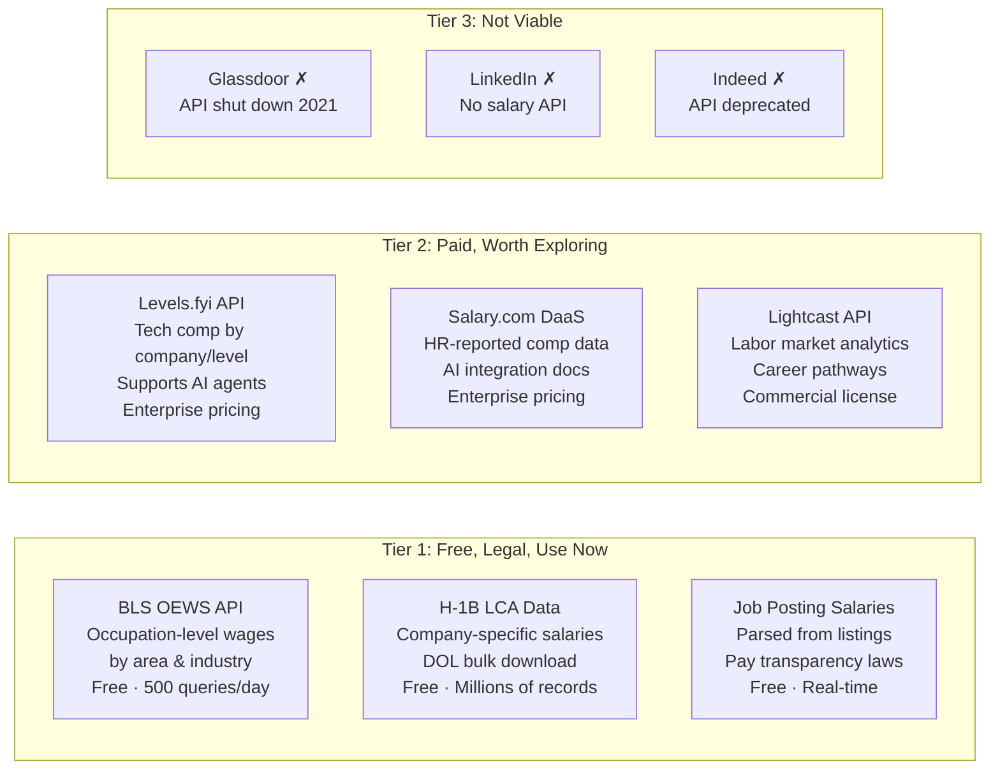

### How It Works

1. **User selects location(s)** during profile setup or job search
2. **BLS OEWS** provides baseline median/mean wages by SOC occupation code + metro area
3. **H-1B LCA data** adds company-specific salary data (especially strong for tech)
4. **Job posting ranges** extracted from listings the agent already pulls (pay transparency laws in NY, CA, CO, WA mean more postings include ranges)
5. **LLM layer** synthesizes all sources into actionable recommendations: "For a Senior Data Engineer in Berlin, the market range is €75K-€95K. You're currently targeting €65K. Aim higher."

Every salary number shows its source and when it was last updated.

### Company Insights (Without Glassdoor)

Since Glassdoor's API is shut down, company review/culture data comes from:

- **LLM knowledge:** Claude/Gemini have trained on extensive company data (funding, culture signals, tech stack)
- **Public data:** Crunchbase (funding), GitHub (tech stack), press/news
- **User-contributed:** As users track applications and log feedback, the platform builds its own dataset
- **Lightcast** (if budget allows): Company profiles and labor market analytics

---

## Multi-Agent Architecture

Ten specialized agents, each running on the optimal model through OpenRouter for cost efficiency:

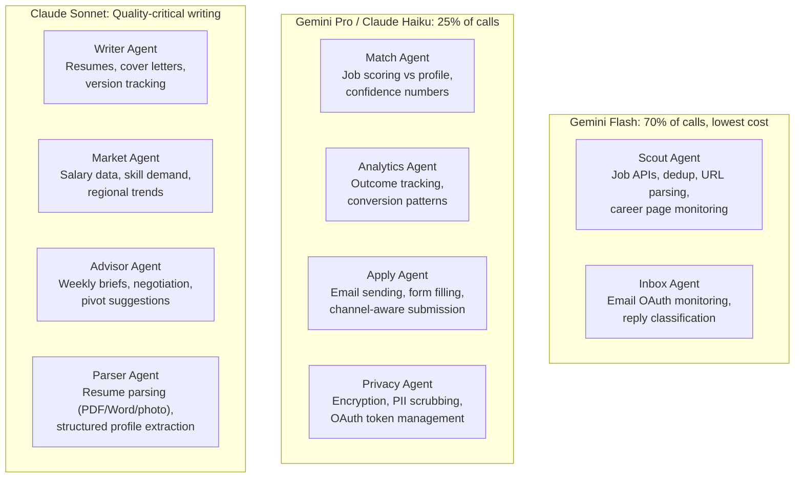

**Blended cost: ~$1.50-3/user/month.** Gemini Flash carries most of the load at near-zero cost. Claude Sonnet handles the 25% where writing quality matters. Opus fires only for edge cases (~5%).

---

## User Flows

### 1. Onboarding: Resume Upload & Autofill

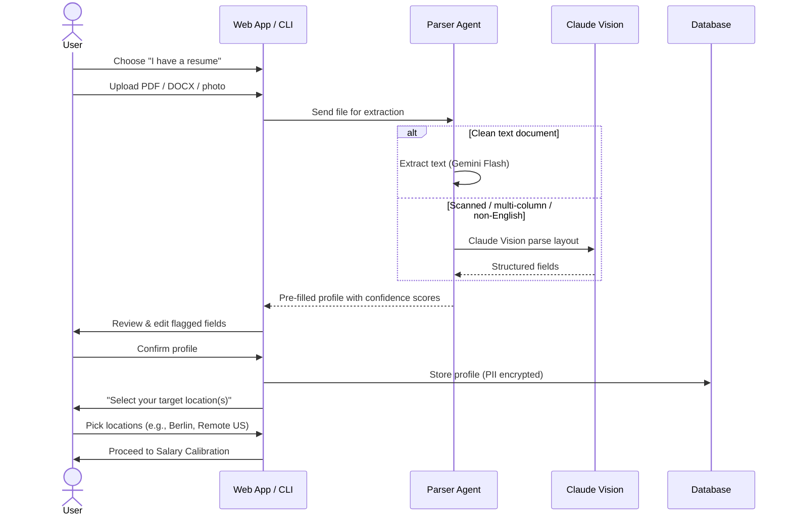

### 2. Location-Based Salary Calibration

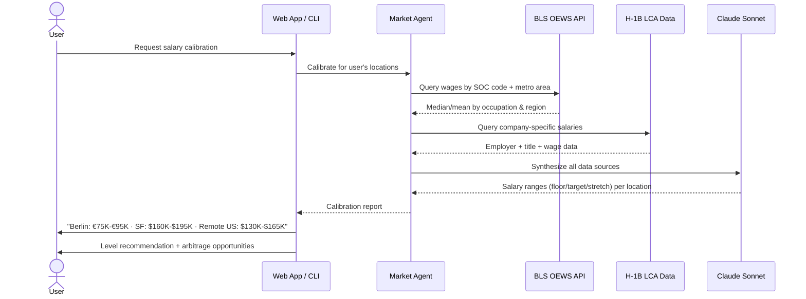

### 3. Job Search & Application

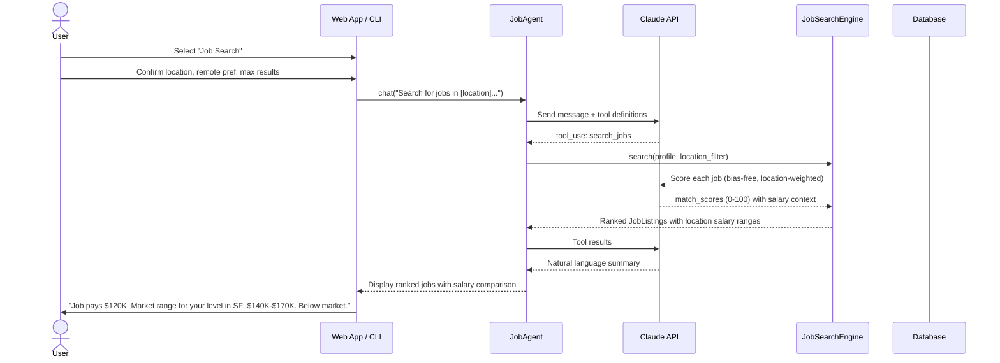

### 4. Autonomous Apply Flow

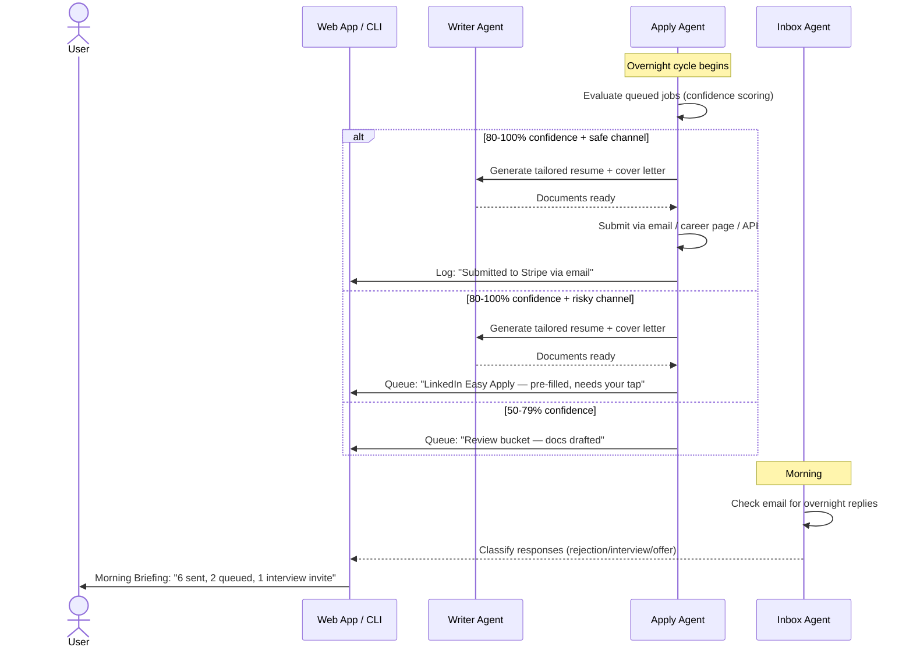

### 5. Analytics & Career Advisor

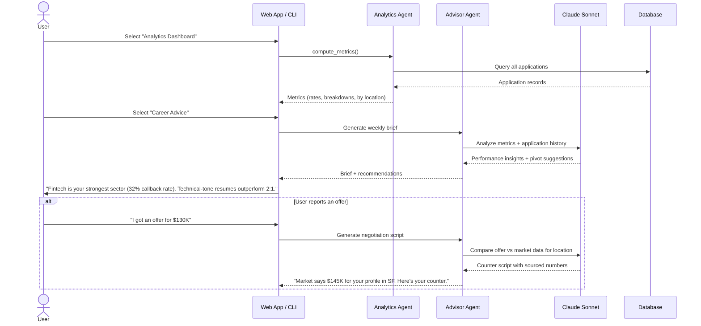

---

## Data Model

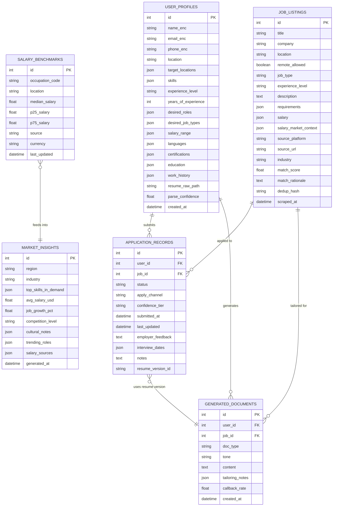

### Key Relationships

- **User → Applications:** One user has many applications (1:N)
- **Job → Applications:** One job listing can have one application per user (1:N)
- **User → Documents:** One user generates many resumes/cover letters (1:N)
- **Job → Documents:** Each document is tailored for a specific job (1:N)
- **Application → Document:** Each application tracks which resume version was used
- **Salary Benchmarks → Market Insights:** Benchmark data feeds into market analysis
- **Market Insights:** Cached per region/industry pair, sourced from BLS + H-1B + job postings

### New Entities (vs v1.0)

| Entity | Purpose |
|--------|---------|
| `SALARY_BENCHMARKS` | Location-specific salary data from BLS, H-1B, and job postings |
| `target_locations` (on USER_PROFILES) | Array of user's chosen locations; anchors all recommendations |
| `salary_market_context` (on JOB_LISTINGS) | How a job's salary compares to market for that location |
| `apply_channel` / `confidence_tier` (on APPLICATION_RECORDS) | Tracks autonomous apply channel and tier |
| `resume_version_id` (on APPLICATION_RECORDS) | Links to which document version was used (for A/B learning) |
| `callback_rate` (on GENERATED_DOCUMENTS) | Tracks which resume/cover letter versions lead to callbacks |

---

## Non-Functional Requirements

### Performance

| Metric | Target |
|--------|--------|
| Resume parsing (PDF/DOCX) | < 8s |
| Resume parsing (image/scan) | < 15s (Claude Vision) |
| Job search response time | < 10s (including LLM scoring) |
| Salary calibration | < 5s (cached BLS/H-1B data) |
| Document generation | < 15s per resume/cover letter |
| Analytics computation | < 2s for up to 1,000 applications |
| API response (health check) | < 100ms |
| Chat endpoint (with LLM) | < 30s |

### Security

- **Encryption at rest:** AES-256-GCM for all PII fields (name, email, phone)
- **Key derivation:** PBKDF2-HMAC-SHA256, 390,000 iterations (OWASP 2023)
- **LLM data isolation:** Only sanitized fields (skills, experience, education) sent to LLM, never PII
- **Bias mitigation:** Protected attributes (gender, age, race, ethnicity, religion, nationality) stripped before all scoring operations
- **No cloud sync (Phase 1):** All user data stored locally in SQLite
- **API security:** CORS configured, session-based isolation, structured error responses (no stack trace leakage)
- **OAuth scopes:** Gmail/Outlook with minimal scopes (readonly + labels). Agent only watches job-related threads.
- **Resume storage:** Uploaded files encrypted at rest, deleted after parsing unless user opts to keep

### Scalability

- **Phase 1 (current):** Single-user SQLite, in-memory sessions, suitable for personal use and demo
- **Phase 2:** PostgreSQL migration via Alembic, connection pooling, async DB sessions
- **Phase 3:** Multi-tenant with user auth, rate limiting, Redis session store

### Reliability

- Health check endpoint always available
- Graceful error handling via `AppError` classes
- `with_retry` decorator for external service calls (LLM API)
- Structured error format: `{ error: { code, message } }`
- Salary data fallback chain: BLS → H-1B → job posting ranges → LLM estimates (always labeled)

---

## Risk Register

| Risk | Severity | Mitigation |
|------|----------|------------|
| **Platform account bans** | CRITICAL | Only auto-submit through safe channels. LinkedIn/Indeed apps queued for user's own tap. Zero ban risk by design. |
| **Legal liability (ToS/scraping)** | CRITICAL | All job data from legitimate APIs or single-URL parsing initiated by user. No scraping. |
| **AI hallucinating credentials** | HIGH | Writer agent can only use verified profile data. Every generated doc shows a diff. System prompts have hard guardrails. |
| **Stale salary data** | HIGH | Multi-source strategy (BLS + H-1B + job postings). Every number shows source and last-updated date. Refreshed monthly. |
| **Aggregator APIs deprecate** | HIGH | Pull from multiple sources; never depend on one. User-pasted URLs work as fallback. |
| **Email OAuth verification delay** | MEDIUM | Start Google OAuth review early (4-6 weeks). Tool works without email; users update statuses manually. |
| **User churn after placement** | MEDIUM | "Career growth mode" keeps tool useful with salary benchmarking, skill tracking, passive monitoring. Annual pricing + referral program. |
| **GDPR / privacy regulations** | MEDIUM | AES-256-GCM encryption. Self-hosted option. EU data residency for cloud. One-click data deletion. Full DSAR compliance. |

---

## Milestones

### Phase 1: Core Agent (✅ Complete)

*Goal: Working agentic job search assistant with privacy-first design*

- [x] Agentic loop with Claude tool-use orchestration
- [x] User profile creation with encrypted PII storage
- [x] Job search with LLM-based bias-free scoring
- [x] Resume generation (3 tones) with tailoring notes
- [x] Cover letter generation with regional awareness
- [x] Application tracking (full CRUD + 7-status workflow)
- [x] Analytics dashboard (response rate, interview rate, offer rate)
- [x] AI-generated insights from application metrics
- [x] Employer feedback pattern analysis
- [x] Market intelligence (regional analysis + application tips)
- [x] Rich CLI with profile wizard and interactive menu
- [x] FastAPI HTTP API (health, chat, session management)
- [x] AES-256-GCM encryption, PII scrubbing, bias guards
- [x] Unit tests (models, analytics, privacy)
- [x] GitHub Actions CI/CD pipeline
- [x] Render deployment configuration

### Phase 2: Smart Onboarding & Live Data

*Goal: Resume parsing, real salary data, and live job feeds*

- [ ] Resume upload & AI parse (PDF, DOCX, image via Claude Vision)
- [ ] Smart autofill with confidence indicators
- [ ] No-resume conversational onboarding
- [ ] O\*NET / ESCO skill taxonomy mapping
- [ ] Location-based salary calibration (BLS OEWS API + H-1B LCA data)
- [ ] Job posting salary range extraction
- [ ] SALARY_BENCHMARKS table and data pipeline
- [ ] Real job board API adapters (Adzuna, JSearch, Remotive)
- [ ] Paste-a-URL job import
- [ ] Cross-board deduplication
- [ ] Company watchlist
- [ ] Skill gap analysis with per-location $ ROI
- [ ] Level calibration ("You qualify for Senior")
- [ ] PDF/DOCX document export
- [ ] Analytics Dashboard UI (KPI cards, pipeline funnel, charts, AI insights panel)
- [ ] Dashboard backend endpoints (`/api/dashboard/kpis`, `/api/dashboard/pipeline`, `/api/dashboard/charts`, `/api/dashboard/insights`)
- [ ] Career Dreamer: what-if scenario builder + gap report + feasibility scorer
- [ ] Career Dreamer: timeline planner + saved dream goals
- [ ] PostgreSQL migration with Alembic
- [ ] Enhanced test coverage (integration + API tests)

### Phase 3: Autonomous Operations & Career Advisor

*Goal: The agent works while you sleep and becomes your career strategist*

- [ ] Channel-aware autonomous apply (auto/review/skip tiers)
- [ ] OAuth email integration (Gmail/Outlook) for response tracking
- [ ] Auto-classification of employer replies (rejection/interview/offer)
- [ ] Morning briefing notification
- [ ] Auto follow-up drafts (7-day ghost detection)
- [ ] Document version tracking & A/B learning
- [ ] AI Career Advisor: weekly performance briefs
- [ ] Pivot suggestions based on rejection patterns
- [ ] Salary negotiation scripts with sourced market data
- [ ] Interview prep & mock interviews
- [ ] Country/region salary arbitrage comparison
- [ ] Mobile-first PWA web application
- [ ] Multi-tenant user authentication
- [ ] Push notifications for new matches and status changes
- [ ] Rate limiting and Redis session store
- [ ] Levels.fyi API integration (enterprise, if budget allows)
- [ ] Lightcast API for career pathway mapping (if budget allows)

---

## Pricing

| | Free / Open Source | Pro | Career Engine |
|---|---|---|---|
| **Price** | $0 | $24/mo | $49/mo |
| Self-hosted, local data | ✅ | ✅ | ✅ |
| Resume parsing + profile builder | ✅ | ✅ | ✅ |
| Application tracker (manual) | ✅ | ✅ | ✅ |
| Basic analytics | ✅ | ✅ | ✅ |
| Privacy encryption | ✅ | ✅ | ✅ |
| AI resume tailoring | 5/month | Unlimited | Unlimited |
| Mobile-first web app | — | ✅ | ✅ |
| Multi-source job feed | — | ✅ | ✅ |
| Autonomous apply (safe channels) | — | ✅ | ✅ |
| Morning briefing | — | ✅ | ✅ |
| Market salary insights | — | ✅ | ✅ |
| Skill gap analysis | — | ✅ | ✅ |
| PDF/DOCX export | — | ✅ | ✅ |
| Email response tracking | — | ✅ | ✅ |
| Outcome learning loop | — | — | ✅ |
| AI career advisor (weekly briefs) | — | — | ✅ |
| Salary negotiation scripts | — | — | ✅ |
| Country arbitrage analysis | — | — | ✅ |
| Career Dreamer (what-if scenarios) | — | — | ✅ |
| Interview prep & mock interviews | — | — | ✅ |
| Company watchlist | — | — | ✅ |
| Automated follow-ups | — | — | ✅ |
| Priority support | — | — | ✅ |

**Cost model:** Blended LLM cost ~$1.50-3/user/month via OpenRouter multi-model routing. Gemini Flash handles 70% of calls at near-zero cost.

---

## Technical Stack

| Layer | Technology |
|-------|-----------|
| Language | Python 3.9+ |
| Web Framework | FastAPI 0.111+ |
| ORM | SQLAlchemy 2.0 (async style) |
| Database | SQLite (Phase 1), PostgreSQL (Phase 2+) |
| Migrations | Alembic |
| Validation | Pydantic v2 |
| LLM Routing | OpenRouter (Claude Sonnet, Gemini Flash/Pro, Claude Haiku) |
| Resume Parsing | Claude Vision + Gemini Flash |
| Salary Data | BLS OEWS API + H-1B LCA bulk data + job posting extraction |
| Encryption | `cryptography` (AES-256-GCM) |
| CLI | Rich |
| HTTP Client | httpx |
| Testing | pytest, pytest-asyncio |
| CI/CD | GitHub Actions |
| Deployment | Render (Python runtime, uvicorn) |
| Payments | Stripe (Phase 3) |

---

## Appendix: Application Status Workflow

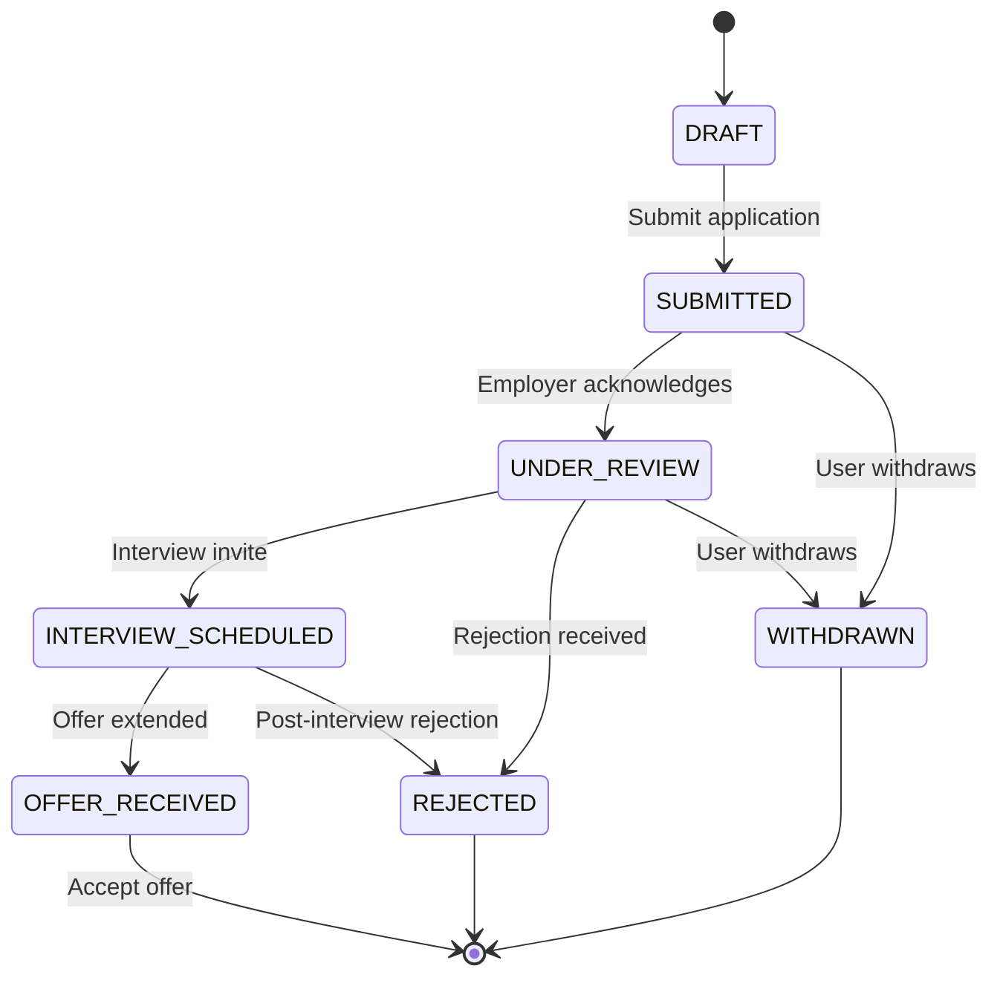

## Appendix: Autonomous Apply Decision Tree

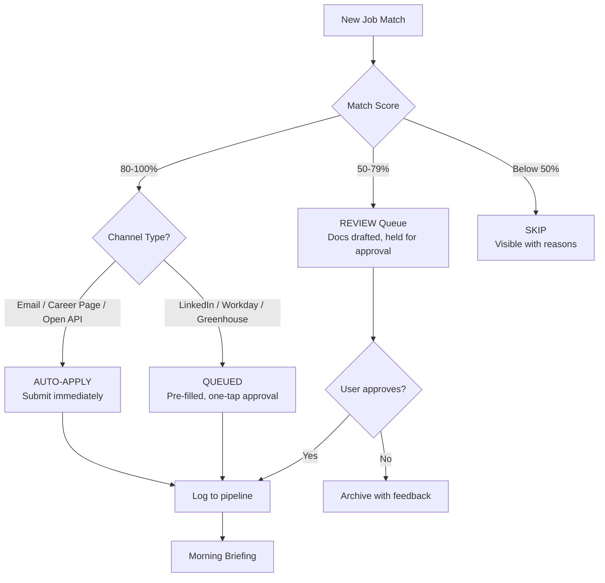

## Appendix: Salary Data Pipeline

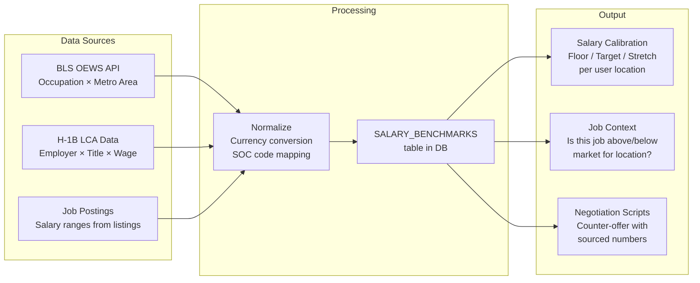
