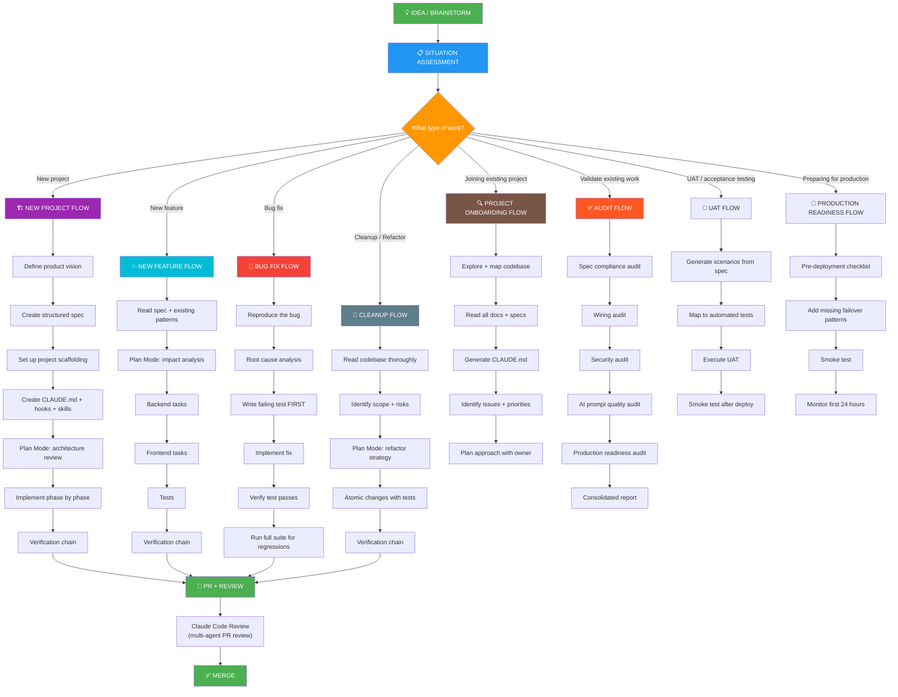

# Universal Claude Code Prompt Library
## From Idea to Production — Every Prompt You'll Ever Need

*Works in: Claude Code CLI, VS Code Extension, Cursor, Windsurf*

---

## Does This Work in VS Code?

**Yes.** Everything in this playbook works identically in VS Code. Claude Code has an official VS Code extension — install it from the marketplace (search "Claude Code" by Anthropic). CLAUDE.md, hooks, skills, subagents, commands — all of it reads from the same `.claude/` directory in your project root regardless of whether you're in the terminal or VS Code.

The only difference is the interface: VS Code gives you inline diffs with accept/reject buttons, a sidebar chat panel, and `@-mention` file references. The underlying engine is identical.

**Setup:** `Ctrl+Shift+X` → search "Claude Code" → Install → click the Spark icon in the sidebar.

---

## The Master Workflow (Mermaid)



---

## Flow 1: NEW PROJECT (From Idea to First Commit)

### Step 1.1 — Define Product Vision

```
I'm starting a new project. Here's my brainstorm/idea:

[paste your brainstorm, notes, sketches, voice memo transcript — raw is fine]

Before writing ANY code, help me structure this into a Product Requirements Document:

1. Product vision (one paragraph: what it is, who it's for, why it matters)
2. Core user personas (2-3 max, with their primary goals)
3. Feature list grouped into MVP vs Phase 2 vs Future
4. For each MVP feature:
   - User story (As a [role], I want [X] so that [Y])
   - Acceptance criteria (Given/When/Then checkboxes)
   - Technical constraints (if any)
5. Non-functional requirements (performance, security, compliance)
6. Tech stack recommendation with justification
7. Out of scope (explicitly state what this is NOT)

Output as a structured markdown document. Do NOT write any code yet.
Save to docs/PRD.md
```

### Step 1.2 — Create Architecture Spec

```
Read docs/PRD.md.

Now create an architecture document covering:

1. System architecture diagram (describe in text, I'll draw it)
2. Data model — every entity, every field, every relationship
3. API design — every endpoint with HTTP method, path, request/response types
4. Frontend component tree — pages, major components, data flow
5. Third-party integrations needed
6. Infrastructure requirements (database, hosting, storage, AI services)

For each major component, specify:
- Input: what data it receives
- Output: what data it produces  
- Dependencies: what it needs to function
- Error cases: what can go wrong

Save to docs/ARCHITECTURE.md
Do NOT write any code yet.
```

### Step 1.3 — Project Scaffolding

```
Read docs/PRD.md and docs/ARCHITECTURE.md.

Set up the project structure. Create:

1. Directory structure following the architecture
2. Package.json / requirements.txt with dependencies
3. TypeScript/Python config files
4. ESLint, Prettier, Ruff config files
5. Git initialization with .gitignore
6. Empty placeholder files for major modules (just the files, no implementation)
7. README.md with setup instructions

Follow 2026 best practices for [framework]. 
Use the latest stable versions of all dependencies.
Do NOT implement any features yet — scaffolding only.
```

### Step 1.4 — Create CLAUDE.md + Hooks + Skills

```
Read docs/PRD.md and docs/ARCHITECTURE.md.

Now create the development infrastructure:

1. CLAUDE.md (under 150 lines):
   - Project identity (what this is, tech stack)
   - Folder structure map
   - Verification commands (lint, type check, test, build)
   - Key patterns to follow
   - Known constraints

2. Hooks (.claude/settings.json):
   - PostToolUse: auto-lint after every file edit
   - PreToolUse: protect .env, lockfiles, migrations
   - Stop: run type check + lint before marking done

3. Directory-scoped CLAUDE.md files:
   - backend/CLAUDE.md (backend-specific rules)
   - src/CLAUDE.md or frontend/CLAUDE.md (frontend-specific rules)
   - tests/CLAUDE.md or e2e/CLAUDE.md (test-specific rules)

4. Any project-specific skills if needed (.claude/skills/)

Make the hooks executable (chmod +x).
Test that each hook works by running it manually.
```

### Step 1.5 — Plan the First Phase

```
Read docs/PRD.md and docs/ARCHITECTURE.md.

Enter Plan Mode. For the MVP's first feature:
1. List every file you will create or modify
2. Separate into BACKEND tasks and FRONTEND tasks
3. For each task, describe the exact changes (2-3 sentences)
4. Identify any risks or dependencies
5. List the tests you will write for each task
6. Estimate complexity (simple/medium/complex)

Save the plan to docs/plans/phase-1-plan.md.
DO NOT write any code until I confirm this plan.
```

### Step 1.6 — Implement (Phase by Phase)

See "Flow 2: NEW FEATURE" below — each phase follows that pattern.

---

## Flow 2: NEW FEATURE (Adding to Existing Project)

### Step 2.1 — Understand Context

```
I need to add a new feature: [description].

Before doing anything:
1. Read CLAUDE.md and MEMORY.md (if they exist)
2. Read the spec at [path/to/spec.md] (if it exists)
3. Search the codebase for similar features already built
4. Identify 2-3 existing files that follow the pattern this feature should follow
5. List all files that will need to change

Tell me:
- Which existing patterns should this follow?
- What are the risks of breaking existing functionality?
- What dependencies does this feature have?

DO NOT write any code yet.
```

### Step 2.2 — Plan (Always Before Implementation)

```
Based on your analysis, create a plan for this feature.

Separate into BACKEND tasks and FRONTEND tasks.

For each task:
- Files to create or modify
- What changes specifically
- What test covers this
- Estimated complexity

Save to docs/plans/[feature-name]-plan.md.
DO NOT write any code until I approve.
```

### Step 2.3 — Backend Implementation (Atomic Tasks)

```
BACKEND TASK [N] of [total]: [task description]

Follow the pattern in [reference file]. 
Read that file first before writing anything.

Requirements:
[paste specific acceptance criteria]

After implementation:
- Run all verification checks
- Confirm the new code passes type checking
- Do NOT touch any frontend files

When done, show me:
- What you created/changed (file paths)
- How it connects to existing code
```

*Run `/clear` between backend tasks.*

### Step 2.4 — Frontend Implementation (Atomic Tasks)

```
FRONTEND TASK [N] of [total]: [task description]

Follow the pattern in [reference component]. 
Read that file first before writing anything.

Requirements:
[paste specific acceptance criteria]

Wire this to the api.ts methods created in the backend tasks.
Add data-testid attributes to all interactive elements.
Handle loading, empty, and error states.

After implementation:
- Run all verification checks
- Do NOT touch any backend files

When done, show me:
- What you created/changed
- The full wire: api.ts method → component → rendered in page
```

*Run `/clear` between frontend tasks.*

### Step 2.5 — Tests

```
Write tests for the [feature name] feature.

1. Unit tests:
   - Backend: test each endpoint (happy path + error cases)
   - Frontend: test each component's key behaviors

2. E2E tests (Playwright):
   - Happy path: user completes the primary workflow
   - Error path: what happens when the API fails
   - Edge case: empty state, max length, invalid input

Follow the test patterns in [reference test file].
Import test and expect from ./fixtures (not @playwright/test).
Use getByRole/getByLabel/getByTestId — NEVER CSS selectors.
NEVER use page.waitForTimeout().

Run the tests and fix until all pass.
Then run the FULL test suite to check for regressions.
```

### Step 2.6 — Verify

```
/project:verify-all [path/to/spec.md]
```

Or manually:

```
Run the verification chain:

1. Check spec compliance: every acceptance criterion in [spec file] 
   — is it IMPLEMENTED, PARTIAL, MISSING, or DIVERGED?
2. Check wiring: every backend endpoint → api.ts → component → rendered UI
3. Check security: auth on every endpoint, input validation, no bare except
4. Check production readiness: no hardcoded URLs, error handling, pagination

Output a single consolidated report grouped by severity.
```

---

## Flow 3: BUG FIX

### Step 3.1 — Reproduce

```
Bug report: [paste the bug description, error message, or user report]

Before fixing anything:
1. Read the relevant code files
2. Understand the current behavior vs expected behavior
3. Identify the root cause (not just the symptom)
4. Explain to me: why is this happening?

DO NOT fix anything yet.
```

### Step 3.2 — Write Failing Test First

```
Now write a test that REPRODUCES this bug.

The test should:
- Set up the conditions that trigger the bug
- Assert the EXPECTED behavior (which will currently FAIL)
- Be named descriptively: "regression: [brief description of bug]"

Run the test and confirm it FAILS.
Show me the test and the failure output.
DO NOT fix the bug yet.
```

### Step 3.3 — Implement Fix

```
Now fix the bug.

Requirements:
- Minimal change — fix only what's broken
- Don't refactor unrelated code in the same change
- Preserve existing behavior for non-bug-related paths
- If the fix requires changing >3 files, list them all and wait for my approval

After the fix:
- Run the regression test — it should now PASS
- Run the full test suite — no existing tests should break
- Run all 5 verification checks
```

### Step 3.4 — Verify No Side Effects

```
The bug is fixed. Now verify there are no side effects:

1. The regression test passes
2. All existing tests still pass (npm run test, npm run e2e)
3. All 5 validation checks pass
4. Search the codebase for similar patterns that might have the same bug
   (e.g., if you fixed a missing null check, are there other places with
   the same missing check?)

If you find similar patterns, list them but DO NOT fix them — 
I'll decide if those are separate tickets.
```

---

## Flow 4: CLEANUP / REFACTOR

### Step 4.1 — Assessment

```
I need to clean up / refactor [area/module/file].

Before touching anything:
1. Read all files in the affected area
2. Map all callers/importers/consumers of the code being refactored
3. Identify all tests that cover this code
4. List every file that would need to change

Tell me:
- Scope: how many files are affected?
- Risk: what could break?
- Strategy: should this be done in one pass or broken into steps?
- Tests: are existing tests sufficient, or do we need more before refactoring?

DO NOT make any changes yet.
```

### Step 4.2 — Add Test Coverage First

```
Before refactoring, ensure we have sufficient test coverage.

Look at the code being refactored:
- Which behaviors are currently tested?
- Which behaviors are NOT tested?

Write tests for any UNTESTED behaviors FIRST, using the current 
implementation. These tests become our safety net — if they pass 
before AND after the refactor, we know we didn't break anything.

Run all tests. Everything should pass.
DO NOT start refactoring yet.
```

### Step 4.3 — Refactor in Atomic Steps

```
Now refactor step [N]: [specific change]

Rules:
- One logical change at a time
- Run tests after EACH change
- If any test fails, fix before proceeding
- Do NOT batch unrelated changes
- Preserve all external behavior (same inputs → same outputs)

After this step:
- All tests still pass
- All 5 verification checks pass
- Show me what changed and why
```

### Step 4.4 — Verify

```
Refactoring complete. Final verification:

1. Run the full test suite
2. Run all 5 validation checks
3. Compare the external behavior: same inputs should produce same outputs
4. Check that no callers/consumers were broken by the internal changes
5. If performance was a goal, show before/after metrics

List any follow-up items discovered during refactoring.
```

---

## Flow 5: JOINING AN EXISTING PROJECT (Project Onboarding)

### Step 5.1 — Explore and Map

```
I've just joined this project and need to understand the codebase.

Explore the project and give me:

1. Project overview: what does this app do?
2. Tech stack: languages, frameworks, major dependencies
3. Architecture: how is the code organized? (folder structure + purpose)
4. Data model: what are the main entities and their relationships?
5. Key entry points: where does the app start? main routes? API endpoints?
6. Build and test commands: how to run, test, lint, build
7. Configuration: env vars needed, config files, secrets
8. Code quality: are there lints, type checking, tests? What's the coverage like?
9. Pain points: obvious code smells, outdated patterns, missing tests
10. Documentation: what docs exist? are they accurate?

Be thorough but concise. I need the mental model, not a file-by-file listing.
```

### Step 5.2 — Generate CLAUDE.md

```
Based on your exploration, generate a CLAUDE.md for this project.

Include:
- Project identity and purpose
- Tech stack summary
- Folder structure map (key directories and what they contain)
- Verification commands (lint, type check, test, build — whatever exists)
- Key patterns the project follows (naming, architecture, error handling)
- Known issues or quirks you discovered

Keep it under 150 lines. Focus on what an AI agent needs to know 
to contribute correctly without breaking things.

Save to CLAUDE.md.
```

### Step 5.3 — Identify Issues and Priorities

```
Now do a health check on this codebase:

1. Security: any obvious vulnerabilities? (missing auth, unsanitized input, exposed secrets)
2. Code quality: deprecated patterns, dead code, duplicated logic
3. Testing: what's tested vs what's not? any flaky tests?
4. Performance: any obvious N+1 queries, missing pagination, unbounded lists?
5. Dependencies: any outdated or vulnerable packages?

For each finding:
- Severity: CRITICAL / HIGH / MEDIUM / LOW
- Location: file path and line
- Description: what's wrong
- Recommended fix: how to address it

DO NOT fix anything yet — I need to align with the project owner first.
```

---

## Flow 6: VALIDATE EXISTING WORK (Audit)

### Step 6.1 — Spec Compliance

```
Validate the current implementation against the spec at [path/to/spec.md].

For every requirement in the spec:
1. Search the codebase for the implementation
2. Trace the full wire: backend → API client → frontend → rendered UI
3. Rate: IMPLEMENTED | PARTIAL | MISSING | DIVERGED

Output as a table with evidence (file:line).
```

### Step 6.2 — Dead Feature Detection

```
For the [module name] module:

Find ALL backend endpoints in the relevant router.
For each endpoint, trace:
- Backend endpoint → api.ts method → component → page/route

Mark each as:
- LIVE: complete wire from endpoint to rendered UI
- DEAD ENDPOINT: backend exists, nothing calls it
- DEAD METHOD: api.ts method exists, no component uses it
- DEAD COMPONENT: component exists, not in any route
- ORPHANED PROP: prop declared but never read

This is not about code quality — it's about finding features that 
look implemented but aren't actually wired up.
```

### Step 6.3 — AI Prompt Quality Audit

```
Find all AI prompt construction in the codebase.
(Search for functions that build prompts for LLM calls)

For each prompt function, score against these 7 criteria:
1. Embeds concrete data (actual values, not descriptions)?
2. Specifies exact output JSON schema with types?
3. Includes anti-hallucination boundary?
4. Specifies audience and purpose?
5. Requires citations for findings?
6. Includes confidence scoring?
7. Has graceful fallback in the calling function?

Output: table with file, function, score (X/7), and what's missing.
```

### Step 6.4 — Security Audit

```
Run a security review of the codebase.

Check:
1. Authentication: every endpoint requires auth?
2. Authorization: every endpoint enforces RBAC/scope?
3. Input validation: user text sanitized? file uploads validated?
4. AI safety: PII redacted before AI calls? injection boundaries?
5. Output safety: no stack traces in errors? export formula injection prevented?
6. Secrets: no hardcoded credentials? env vars used?

For each finding, attempt to DISPROVE it (check for middleware, decorators,
base classes that might handle it elsewhere). Only report CONFIRMED issues.

Output: findings table with severity, file, issue, and remediation.
```

---

## Flow 7: UAT (User Acceptance Testing)

### Step 7.1 — Generate UAT Scenarios From Spec

```
Read the spec at [path/to/spec.md].

Generate a UAT scenario pack covering:

For each user-facing feature:
1. Happy path scenario (P0)
2. Error/edge case scenario (P1)
3. Boundary condition scenario (P2)

Format each scenario as:

### UAT-[NNN]: [Feature] — [Scenario Type]
**Priority:** P0 | P1 | P2
**Preconditions:** [what must be true before testing]
**Steps:**
1. [concrete user action]
2. [concrete user action]
3. [concrete user action]
**Expected Result:** [exactly what should happen]
**Status:** NOT RUN
**Tester:** ___
**Date:** ___

Save to docs/uat/UAT_SCENARIOS.md

Also generate docs/uat/UAT_CHECKLIST.csv:
UAT_ID,Feature,Priority,Scenario,Status,Tester,Date,Defect_ID,Notes
```

### Step 7.2 — Map UAT to Automated Tests

```
Read docs/uat/UAT_SCENARIOS.md.
Read the test files in [e2e/ or tests/].

Create a traceability matrix:

| UAT ID | Scenario | Has Automated Test? | Test File:Line | Coverage Gap |
|--------|----------|--------------------:|----------------|-------------|

For each UAT scenario WITHOUT an automated test:
- Can it be automated? (yes/no + reason)
- If yes: write the test. Name it with the UAT ID (e.g., "UAT-003: user can reset password")
- If no: document what manual verification is needed

Output the updated matrix.
```

### Step 7.3 — Execute UAT

```
Run all automated UAT scenarios and update the checklist.

For each P0 scenario:
1. Find the corresponding automated test
2. Run it
3. Record PASS or FAIL in docs/uat/UAT_CHECKLIST.csv

For scenarios without automated tests:
- Mark as MANUAL_REQUIRED in the checklist
- List the manual steps needed

Summary:
- P0: X/Y passed, Z failed, W need manual testing
- P1: X/Y passed, Z failed, W need manual testing
- BLOCKING: list any P0 failures that must be fixed before deployment
```

### Step 7.4 — Smoke Test After Deployment

```
The app has been deployed to [staging URL / production URL].

Run a deployment smoke test:

1. Can the home page load? (check for 200 response)
2. Can a user log in? (if auth exists)
3. Do critical API endpoints respond? (list the 3-5 most important)
4. Are database connections working? (hit an endpoint that queries data)
5. Are external services reachable? (AI API, email, storage, etc.)
6. Is the health check endpoint responding? (/health or /healthz)

For each check: PASS or FAIL with response time.

If ANY critical check fails:
- Recommend rollback: yes/no
- Identify the likely cause
- Suggest immediate fix
```

---

## Flow 8: PRODUCTION READINESS & FAILOVER

### Step 8.1 — Pre-Deployment Verification

```
This feature/release is about to go to production.

Run a production readiness review:

### Environment & Config
- [ ] All env vars documented in .env.example (no missing vars)
- [ ] No hardcoded localhost URLs or ports
- [ ] No hardcoded secrets or API keys
- [ ] CORS configuration is restrictive (not wildcard *)
- [ ] Rate limiting is configured on public endpoints

### Health & Monitoring
- [ ] Health check endpoint exists (/health or /healthz)
- [ ] Health check verifies: app running + database connected + critical services reachable
- [ ] Structured logging is configured (not console.log in production)
- [ ] Error tracking is configured (Sentry, LogRocket, or equivalent)

### Failover & Resilience
- [ ] Database connection has retry with exponential backoff
- [ ] External API calls have timeouts configured (not infinite)
- [ ] External API calls have retry logic for transient failures
- [ ] AI/LLM calls have fallback (rule-based when AI is unavailable)
- [ ] AI/LLM responses are validated through schemas (not raw strings)
- [ ] Background jobs have dead letter / retry mechanism
- [ ] Graceful shutdown handler exists (finish in-flight requests, close DB connections)

### Data Safety
- [ ] Database migrations are backward-compatible
- [ ] New columns have default values (won't break existing rows)
- [ ] No destructive migrations (column drops, table drops) without data migration
- [ ] Backups are configured and tested

### Rollback Plan
- [ ] Previous version can be redeployed in < 5 minutes
- [ ] Database changes are forward-compatible (old code works with new schema)
- [ ] Feature flags exist for risky features (can disable without redeploy)

For each UNCHECKED item: file path, what's missing, and priority to fix.
```

### Step 8.2 — Add Missing Failover Patterns

```
Based on the production readiness review, the following failover patterns 
are missing. Implement them:

1. Health check endpoint (if missing):
   - GET /health returns { "status": "ok", "db": "connected", "version": "..." }
   - Returns 503 if database is unreachable

2. Graceful shutdown (if missing):
   - Listen for SIGTERM/SIGINT
   - Stop accepting new requests
   - Finish in-flight requests (with timeout)
   - Close database connections
   - Exit cleanly

3. External service timeouts (if missing):
   - Set explicit timeout on every HTTP client call
   - Add retry with exponential backoff for transient errors (5xx, timeout)
   - Log failures with enough context to debug

4. AI/LLM fallback (if applicable and missing):
   - Try primary AI call
   - On failure: retry once with backoff
   - On second failure: fall back to rule-based/cached response
   - Log the fallback event
   - Surface to user with subtle indicator (not error)

Implement only what's missing. Show me what you added.
```

### Step 6.5 — UAT Readiness Check

```
Before declaring this feature/phase complete, run a UAT readiness check.

1. Read docs/uat/UAT_TEMPLATE.md (or create one if it doesn't exist)
2. For each P0 scenario:
   - Does the feature exist in the codebase?
   - Is there an automated test that covers this scenario's steps?
   - If not automated, flag as MANUAL REQUIRED
3. For each P1 scenario:
   - Same checks, but non-blocking

Output:
| UAT ID | Scenario | Priority | Automated? | Test File | Status |
|--------|----------|----------|-----------|-----------|--------|

Summary:
- P0 automated coverage: X/Y scenarios
- P0 manual required: Z scenarios
- Blocking: list any P0 scenarios with NO coverage (automated or manual)

DO NOT mark this feature as complete if any P0 scenario has zero coverage.
```

### Step 6.6 — Failover & Resilience Audit

```
Check the codebase for production resilience patterns.

1. Health checks:
   - Does a /health or /healthz endpoint exist?
   - Does it check database connectivity?
   - Does it check external service availability?

2. Graceful shutdown:
   - Does the server handle SIGTERM/SIGINT?
   - Does it drain active connections before stopping?
   - Does it close database pools cleanly?

3. Retry & timeout patterns:
   - Do external API calls have timeouts configured?
   - Do database connections retry with backoff on failure?
   - Do AI/LLM calls have timeout + fallback?

4. Error isolation:
   - Can one failed external service take down the whole app?
   - Are there circuit breaker patterns (or at minimum, timeout + catch)?
   - Do async jobs have dead letter / retry queues?

5. Data safety:
   - Are database transactions used for multi-step operations?
   - Is there rollback on partial failure?
   - Are idempotency keys used for payment/critical operations?

For each gap found:
- File: [where it should be]
- Issue: [what's missing]
- Risk: [what happens in production without it]
- Fix: [concrete implementation suggestion]

Rate overall resilience: PRODUCTION-READY | NEEDS WORK | NOT READY
```

### Step 6.7 — Staging/Pre-Production Smoke Test

```
We're about to deploy. Run a pre-deployment smoke test checklist.

Verify:
1. Environment configuration:
   - All required env vars are documented (not just in .env.example)
   - No dev-only values (localhost, debug=true) in staging config
   - Secrets are in secret manager, not committed to repo

2. Database:
   - All migrations run cleanly on a fresh database
   - Seed data exists for required lookup tables
   - No pending migrations that haven't been applied

3. External services:
   - API keys for all external services are valid for the target environment
   - Webhook URLs point to the correct environment
   - CORS allows the correct origins

4. Critical paths (run these manually or via E2E):
   - [ ] User can sign up / log in
   - [ ] Core workflow completes end-to-end
   - [ ] Error states show user-friendly messages (not stack traces)
   - [ ] File uploads work within size limits
   - [ ] Email/notification delivery works

5. Rollback readiness:
   - Can we revert the deployment in under 5 minutes?
   - Are database migrations reversible?
   - Is the previous version still deployable?

Output: GO / NO-GO with specific blockers for NO-GO.
```

---

## Utility Prompts (Use Anytime)

### "Run UAT" — Execute Acceptance Testing

```
Run UAT for the [feature/module] we just completed.

1. Read docs/uat/UAT_TEMPLATE.md
2. For each scenario relevant to this feature:
   - If an automated test exists: run it, report PASS/FAIL
   - If no automated test: describe what manual steps are needed
3. For any FAIL: identify the root cause and whether it's a code bug or test bug
4. Update docs/uat/UAT_CHECKLIST.csv with results

Output:
- P0 results: X passed, Y failed, Z need manual testing
- P1 results: X passed, Y failed, Z need manual testing  
- Blocking issues: [list any P0 failures with root cause]
- Recommendation: READY TO SHIP / FIX REQUIRED / MANUAL TESTING NEEDED
```

### "I'm Lost" — Context Recovery

```
I've been working on this for a while and lost track.

Read the git log (last 20 commits), the current diff, and MEMORY.md.

Tell me:
1. What was I working on?
2. What's the current state? (what's done, what's in progress)
3. What's left to do?
4. Are there any broken tests or lint errors right now?

Show me a checklist of remaining tasks.
```

### "Is This Right?" — Quick Verification

```
I just finished [task description].

Quick check:
1. Does it compile? (run type check)
2. Do tests pass? (run test suite)
3. Is it wired correctly? (trace from source to consumer)
4. Did I miss anything from the original instruction?

Be concise — yes/no with evidence for each.
```

### "Before I PR" — Pre-PR Checklist

```
I'm about to create a PR for this work.

Run the full verification:
1. All 5 validation checks (syntax, types, lint for both languages)
2. Full test suite
3. Check for console.log/print statements in production code
4. Check for hardcoded URLs, secrets, or credentials
5. Check for TODO/FIXME/HACK comments that should be resolved
6. Check the git diff for any accidental changes to unrelated files

Give me a GO / NO-GO with specific issues for NO-GO.
```

### "Update This Document" — Keep Memory Fresh

```
I just finished [task/feature].

Update the following (only the sections that changed):
1. MEMORY.md — add any new facts (stable, verified info only)
2. CLAUDE.md — if any new patterns or pitfalls were discovered
3. The relevant phase/spec file — mark completed items

Do NOT rewrite sections you didn't change.
Show me the diff of what you updated.
```

### "Explain This Code" — Understanding Existing Code

```
Explain [file path or function name]:

1. What does it do? (one sentence)
2. How does it work? (step by step, with the key decisions)
3. What calls it? (trace upstream callers)
4. What does it call? (trace downstream dependencies)
5. What could go wrong? (error cases, edge cases)
6. How is it tested? (find the relevant tests)

Keep it concise. I need to understand it, not read a novel.
```

### "Compare Approaches" — Decision Making

```
I need to decide between:
A) [approach A description]
B) [approach B description]

For each approach, analyze:
1. Implementation complexity (how many files, how much new code)
2. Performance implications
3. Maintenance burden (how easy to change later)
4. Risk (what could go wrong)
5. Compatibility with existing patterns in this codebase

Recommend one with clear reasoning. If it's a close call, say so.
```

---

## Command Quick Reference

Create these as files in `.claude/commands/` for one-command access:

| Command | File | Usage |
|---------|------|-------|
| Verify all | `verify-all.md` | `/project:verify-all [spec-path]` |
| Audit spec | `audit-spec.md` | `/project:audit-spec [spec-path]` |
| Audit wiring | `audit-wiring.md` | `/project:audit-wiring [module]` |
| Audit prompts | `audit-prompts.md` | `/project:audit-prompts` |
| Audit security | `audit-security.md` | `/project:audit-security` |
| Audit resilience | `audit-resilience.md` | `/project:audit-resilience` |
| Run UAT | `run-uat.md` | `/project:run-uat [feature]` |
| Pre-deploy smoke | `pre-deploy.md` | `/project:pre-deploy` |
| Health check | `health-check.md` | `/project:health-check` |
| Context recovery | `where-am-i.md` | `/project:where-am-i` |
| Pre-PR check | `pre-pr.md` | `/project:pre-pr` |

---

## Cheat Sheet: Which Prompt for Which Situation

| Situation | Flow | First Prompt |
|-----------|------|-------------|
| "I have a product idea" | Flow 1 | Step 1.1 (Define Product Vision) |
| "I need to add a feature" | Flow 2 | Step 2.1 (Understand Context) |
| "Something is broken" | Flow 3 | Step 3.1 (Reproduce) |
| "This code is messy" | Flow 4 | Step 4.1 (Assessment) |
| "I just joined this project" | Flow 5 | Step 5.1 (Explore and Map) |
| "Does this match the spec?" | Flow 6 | Step 6.1 (Spec Compliance) |
| "Generate UAT scenarios" | Flow 7 | Step 7.1 (Generate Scenarios From Spec) |
| "Run acceptance tests" | Flow 7 | Step 7.3 (Execute UAT) |
| "We just deployed — is it working?" | Flow 7 | Step 7.4 (Smoke Test After Deploy) |
| "Is this production-ready?" | Flow 8 | Step 8.1 (Pre-Deployment Verification) |
| "Add failover / resilience patterns" | Flow 8 | Step 8.2 (Add Missing Failover) |
| "I'm lost, where was I?" | Utility | Context Recovery |
| "Am I ready to PR?" | Utility | Pre-PR Checklist |
| "Which approach should I use?" | Utility | Compare Approaches |
